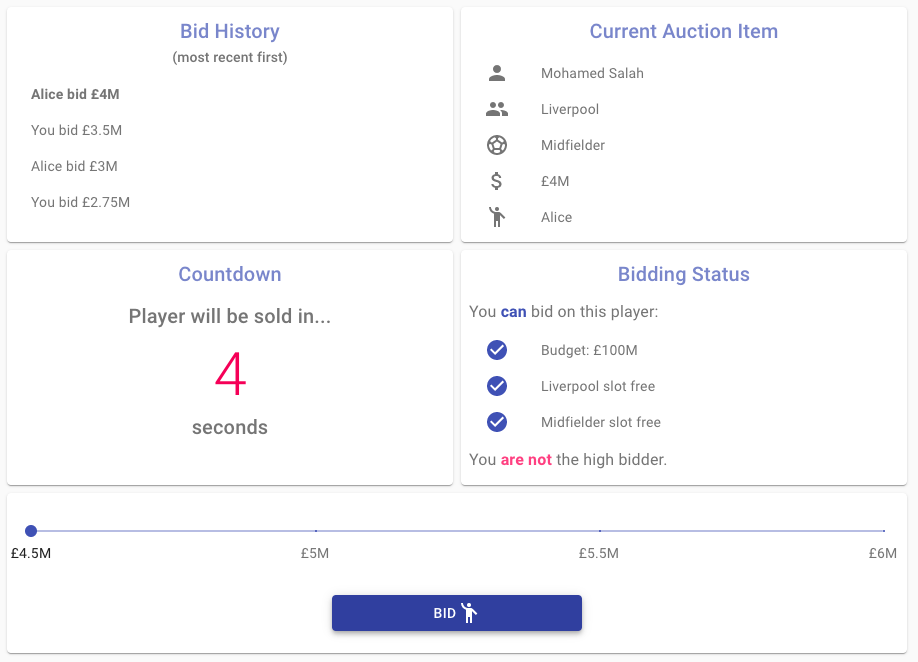
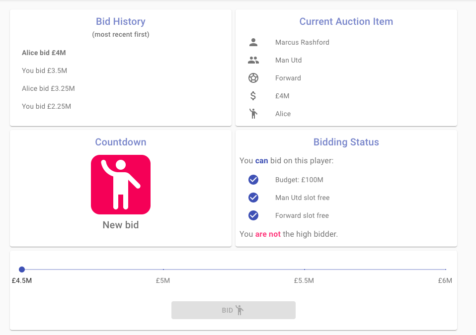
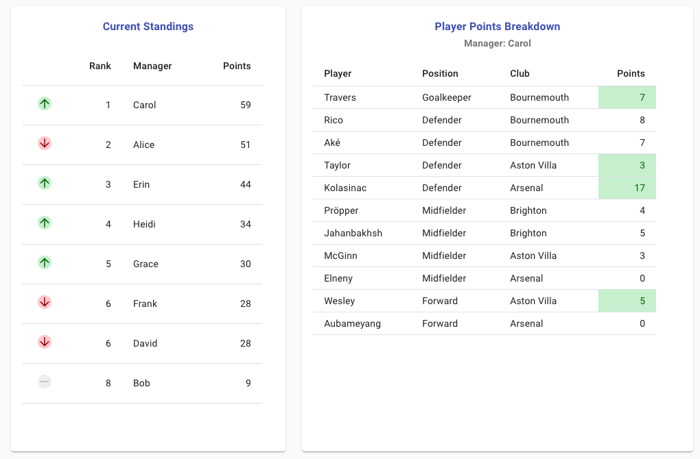
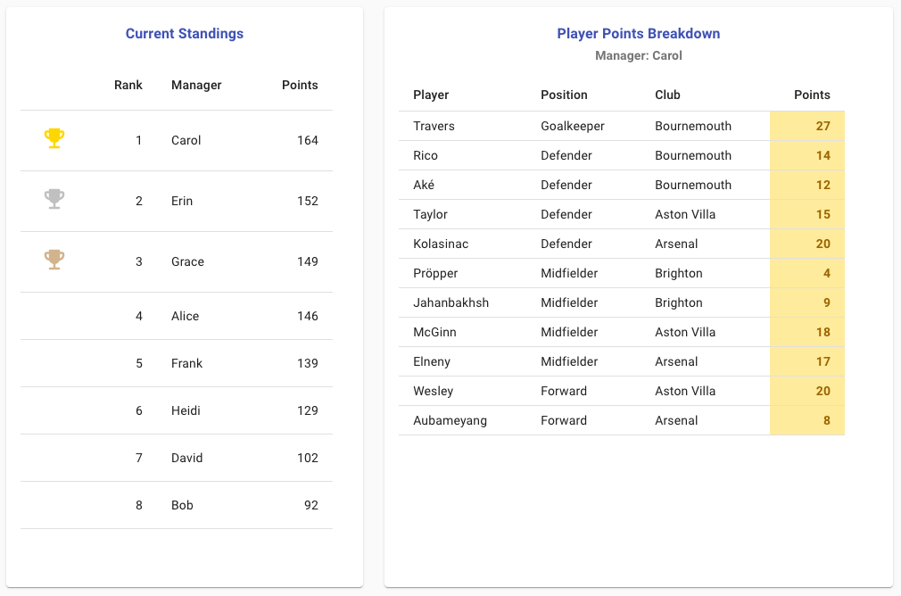

\newpage

# Introduction

This report documents the development of a multiplayer fantasy football game, featuring a real-time auction, implemented as a web application.

## Terminology

In this document, **football** refers to the sport known also as association football, or soccer in some countries.

The word **player** will always refer to a real-life football player, as opposed to a person playing this fantasy football game. The person using the application will typically be referred to as the **user**, but depending on the context they may also be referred to as a **manager** (of their fantasy football team) or a **participant** (in an auction).

Similarly, a distinction between real-life football clubs and fantasy teams is necessary. A real-life football club (e.g. Liverpool or Arsenal) will be referred to as a **club**, whereas where the word **squad** is used, it will always refer to a fantasy team. The word **team** may refer to either, but its meaning will be made clear from the context.

## Fantasy Sports

Fantasy sports are games in which participants build imaginery teams consisting of real sports players. These fantasy teams then compete against each other, scoring points based on the real-life performance of the players selected. Fantasy sports predate the Internet[@fantasy_sports], but the game format is well-suited to online play.

There are several variations in how the game is played, even before taking into account different sports. In some variations, the same player can appear in an unlimited number of fantasy teams. This is common in large leagues which allow thousands or even millions of participants, where it would be infeasible to place constraints on how many participants can have a certain player in their team.

In smaller leagues however, it is common that each player can appear in only one fantasy team in the league. In such cases, it is necessary to begin the game with some method of working out which managers get which players for their fantasy teams. The simplest method is known as the **draft**: managers simply take it in turns to select a player from those available, until all squads are complete. However, for those looking for an extra layer of strategy, the **auction** is preferred. In an auction, each manager starts out with a fixed budget, and must assemble a squad of players by bidding against other managers. The auction is the method of squad selection which has been chosen for this application.

Another distinction to draw is between **daily** and **season-long** fantasy sports. In season-long games, the idea is to pick a squad that will score the most points over an entire season, typically over many months. Mid-season changes to squads are often permitted in these games. In daily games, the aim is to pick a squad which will score well in one specific event. Despite the name, this event may last for a few days (for example, a four-day golf tournament, or a round of football fixtures spread over a weekend). In such games, once the initial squad is selected, it typically cannot be changed. Point-scoring is typically also more granular in daily games. In football for example, a season-long game might only award points for goals scored or assisted, but a daily game will additionally award a small number of points for more common occurrences such as completing a pass, or a successful tackle.

This application is intended for daily games, although most of the logic could apply to either and could be adapted.

## Real-Time Communication in Web Applications

The traditional model of communication in web applications sees the client sending a request to a server, and waiting for a response from the server. This response might contain a static webpage, or some data which will update the content on the current page. At this point, the server will not send anything else to the client until another request is received. This model works well for many applications, but is not suitable for applications which require real-time bi-directional communication such as chat rooms or multiplayer games. These applications require that the server is able to push data to clients, without waiting for a request.

This behaviour can be naively imitated by having the client send multiple requests to the server at regular intervals to check for updates. However, this approach involves a lot of overhead due to the number of requests, so wasn't seriously considered for use in this application.

A slightly better alternative is known as **long polling**. It still involves the client sending a request, but the server holds the connection open for as long as possible, only sending a response when it has new data. However, **WebSockets**, which were first supported in Google Chrome in 2010, offer true bi-directional communication channels. This means that for as long as the WebSocket connection is open, either the client or server can send data.[@websockets]

Although it is helpful to have some understanding of the underlying technology, the application developer can make use of libraries which abstract away the complexities of implementing such communication channels. The library ultimately chosen for use in this project was **Socket.IO**. It uses WebSockets to manage its connections where possible, but in very old browsers it will fall back on long polling. This gives the best of both worlds, although in 2020 browsers without WebSocket support are increasibly rare.

## Motivation

Although fantasy football has successfully made its transition to the online world, options for real-time online auctions are limited. The first fantasy football provider in the UK, Fantasy League, requires that their users conduct a traditional live auction offline, with the resulting squads manually uploaded afterwards. The only option offered for an online auction involves *sealed bids*[@fantasy_league] - a process in which managers submit their maximum bids secretly, and the highest bidder is then calculated. This offers less excitement than a traditional auction in which managers compete to outbid each other in real-time. The motivation behind building this application was to offer users the best of both worlds: the convenience of an online auction, and the real-time decision making and excitement of a traditional live auction.

## Application Overview

The game is a web application which has been developed using JavaScript on both the frontend and backend. It features real-time bi-directional communication which allows users to compete in a live auction, during which they can bid against rival managers to build their squad of players. All users are immediately notified of new bids, and can react accordingly. A screenshot showing part of the application while an auction is in progress is shown in figure \ref{overview} - it shows what information is available to the user while they are deciding whether or not to make a new bid. In this case, they have 4 seconds remaining to make a bid, or else the player will be sold to another manager.

Figure \ref{newbid} shows the notification that the user receives in real-time (in the bottom left quadrant) when a rival manager has made a new bid. The new bid resets the countdown timer, and a second after the notification is shown, bidding begins again with a 10 second countdown timer.

Once all squads have been filled in accordance with the parameters chosen for the fantasy league in question, the next stage of the game involves points being scored. Users receive real time updates on points scored, as demonstrated in figure \ref{livepoints}, where the colour coding indicates changes since the last update.

Finally, the winner is the manager whose squad has accumulated the most points upon completion of the points-scoring phase of the game. The final standings are shown in figure \ref{complete}.

The development of this application is explored in signficantly more detail in the remainining sections of this document.
