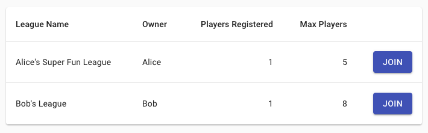

\newpage

# Requirements

A list of high-level requirements was drafted up for the proposal, split into two sections:

* Requirements for Minimum Viable Product (MVP).
* Additional features to be added as time permitted.

All MVP requirements were successfully implemented, along with some of the additional features.

## User Stories

Each item on the initial list of requirements could be considered a user story. A user story is typically a few sentences of simple, non-technical language, which explains the desired outcome from the user's perspective.[@user_stories]

During development of this application, user stories were organised on a Trello board. An example of how the board looked during the early stages of development can be seen in figure \ref{trello}.

The **In Progress** and **Complete** sections are as the names suggest. The distinction between **Backlog** and **To Do** exists to prioritise certain stories ahead of others, although the intention is not to indicate that stories in the **Backlog** are less important. In the example shown, it made sense in the context of building this application that users must be able to join leagues before they can participate in the auction. This is why the latter was placed in the **Backlog** list until development of this feature could realistically begin, and only at this point was it moved to the **To Do** list.

## Minimum Viable Product

The MVP requirements stated that the user must be able to carry out the following tasks:

* Create an account, login to said account, and logout.
* Create a new fantasy league which other participants may join.
* Join an existing fantasy league.
* Participate in a real-time auction, during which they will bid against other participants in their league on real football players to join their fantasy team.
* After the auction is completed, view records of points scored by their own team, and other teams in their fantasy league, as points are scored based on performance of the football players in real games.

With the exception of the first item on the list above, about which there is little of interest to discuss, some further detail on each high-level requirement follows.

### Create a League

The bare minimum requirement here was that the user must be able to create a fantasy league which others could later join, and give it a unique name of their choosing. This is the version which was implemented in early iterations, to allow development to progress as quickly as possible.

In later versions, additional functionality was added to the league creation process, giving the user more control over the rules of the game. The complete list of options available to the league creator is:

* **League name**
* **Number of Participants**
* **Event** - this refers to the real-life football fixtures in which points will be scored. For example, 'Premier League Week 1'.
* **Max Players Per Club** - setting a low value here helps to avoid a situation where only players from the best clubs are selected.
* **Number of Goalkeepers/Defenders/Midfielders/Forwards** - these settings refer to the four main positions for football players. The default setting is 1 goalkeeper, 4 defenders, 4 midfielders and 2 forwards - 11 players in total, which is how a real-life football team might line up. However, if a league creator wants each manager to build a bigger squad of players, they can change this setting. Alternatively, they might want a very fast auction, in which case they could limit the total squad size to only 5 players. There is no reason that a fantasy team's composition must match that of a real football team.

### Join a League

Users must be able to join leagues created by other users, subject to constraints:

* A user cannot join a league they have already joined.
* A user can only join a league if the auction has not yet started, and the league is not full.

Before they can join a league however, the user must be able to view a list of available leagues which they are permitted to join. An example of this can be seen in figure \ref{join}.

### Participate in Auction

The requirements for the real-time auction component of the application had to be fleshed out significantly before development could begin. The following more detailed rules were drawn up to describe how the auction logic was expected to function:

* The auction can only begin once the league is full.
* Once the league is full, the league creator can trigger the start of the auction.
* All auction participants start with a budget of £100M, with which to purchase players.
* Once the auction has started, participants must take it in turns to pick a player to be auctioned off to the highest bidder (the participant who selected a player is considered to have opened the bidding at £0).
* All bidding must occur in real-time, with details of bids shared immediately with other participants.
* A player is sold to the highest bidder after 10 seconds of no bidding.
* A participant may be prevented from bidding on a certain player for any of the following reasons:
    * They do not have sufficient budget to make a bid which is higher than the current highest bid.
    * They are already the highest bidder.
    * They have too many players from one club (e.g. Liverpool).
    * They have too many players in one position (e.g. defender).
* The auction can only end once all participants have completed a full squad of players as defined by the rules.

## Additional Features

The list of optional additional features in the proposal stated that ideally, the user would be able to:

* Participate in more than one fantasy league at a time.
* Make changes to their team after the initial auction.
* Set up automatic bidding by preselecting the maximum amount they would be willing to bid on each player.
* Access the web application using a mobile-friendly user interface (responsive design).
* Customise league with different options relating to the rules of the game.

### Additional Features Implemented

The requirement to allow the user participate in more than one fantasy league at a time was implemented as intended. Although it would be impractical for a user to attempt to participate in multiple auctions at once (given the real-time nature of the game), it is technically possible - all they would need to do is open multiple browser tabs and browse to the appropriate league in each. A more practical application of this feature might be to allow a user to register or create some leagues for next week's fixtures, while they are monitoring points being scored for their existing league.

The ability to customise the league with different options was successfully implemented.

### Additional Features Not Implemented

The application does not currently allow the user to make changes to their squad after the initial auction, nor does it allow the user to set up automatic bids. Both are features which could potentially improve the game, but there is also a concern that they could detract in some way from the auction, for the following reasons:
* If a user can edit their squad after the auction, the auction holds less importance.
* The idea of automation is perhaps more suitable for a business application such as on online shopping site, rather than a fun game in which the auction is supposed to be one of the most enjoyable parts.

Some attempt was made to make the user interface responsive, but ultimately the amount of information that is necessary for the user to see while playing a real-time game such as this made it difficult. In its current state, the game is not fit for consumption on a mobile device, but works well on a large tablet (e.g. 10.2" iPad) or bigger. Although difficult, this is a feature that would surely have to be implemented for the game to have appeal in 2020.
