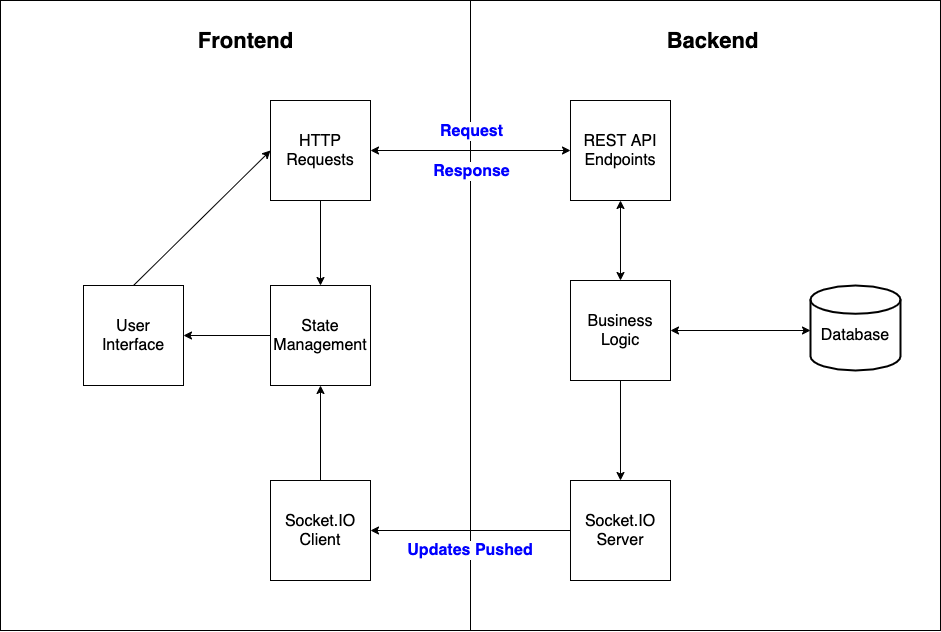
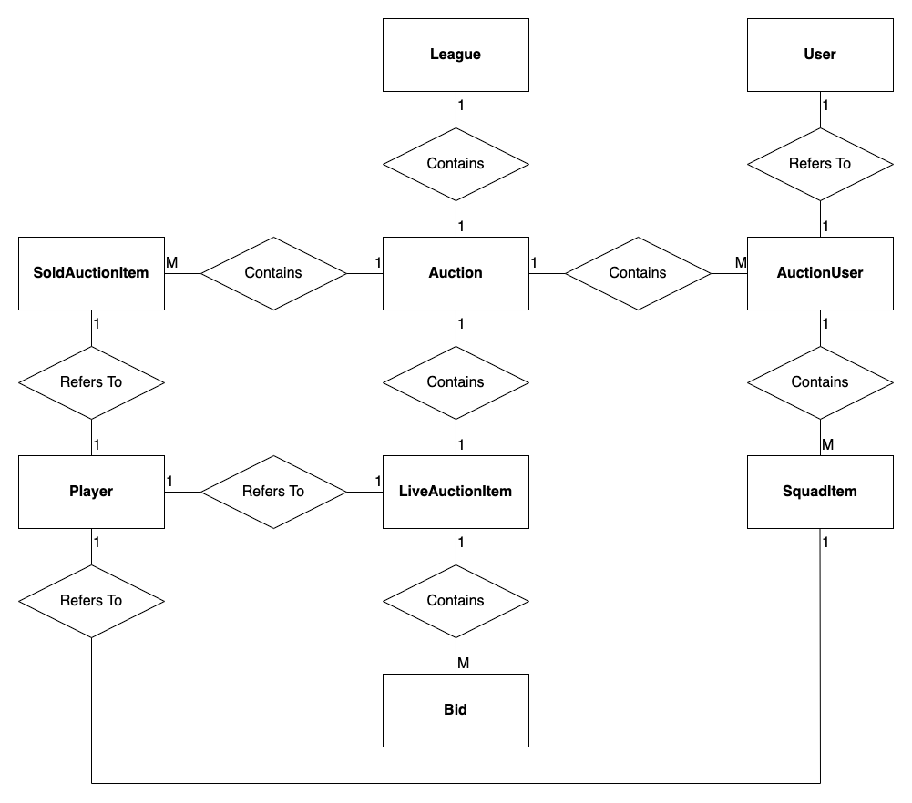
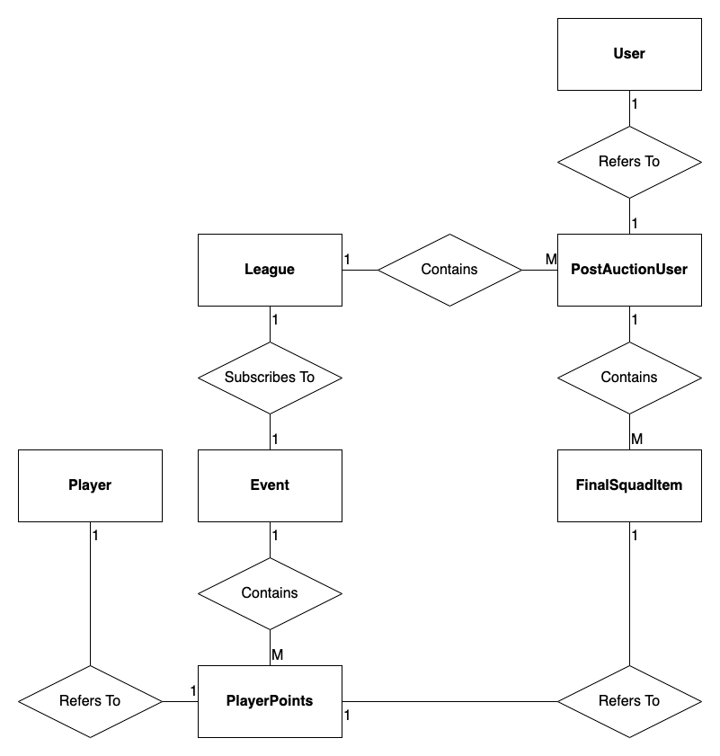

\newpage
# Design and Planning

Before development could begin, additional work was required in three different areas:

* **High Level Architecture** - identifying the different components required to form a complete web application, and how they will communicate with each other.
* **Data Modelling** - identifying which entity classes were required, and their relationships to each other.
* **Technology Stack** - researching appropriate technologies for implementation.

## High Level Architecture

The first choice was to decide which of the following two approaches to take:

* The traditional approach, which involves most of the application logic being performed on the server, with appropriate HTML returned to be displayed in the browser.
* The **Single Page Application** (SPA) approach, which allows for most of the user interface logic to be handled by client-side code which simply consumes data from the server.

An article on Microsoft's website[@spa_traditional] states that the traditional approach is better suited to websites with simple client-side requirements, and that SPAs are better suited to applications which require more complex user interface functionalities than what basic HTML forms can offer. Given the requirements of this application, the **SPA** approach was selected.

This decision meant that the server would be responsible simply for providing the client with the appropriate data, rather than returning HTML pages to display. Although the specific needs of this application meant that real-time bi-directional communication was a requirement, it was also necessary to consider more traditional requests. For example, a user must be able to send a request to log in, or view a list of available leagues to join. For this reason, it was decided to implement a **REST API** on the backend in addition to the **Socket.IO** server to push real-time updates.

**API** stands for Application Programming Interface - a means by which programs talk to each other. **REST** stands for Representational State Transfer. A REST (or RESTful) API is an API which follows a particular set of rules - it receives requests from client programs, and sends appropriate responses. There are different types of request for different purposes. A **GET** request typically involves the client program making a request for data from the server - for example, a user requesting to see a list of players. A **POST** request will typically involve the client sending some new data to be written to the server's database. In this application, a user creating a new league would be an example of a use case for which a POST request would be appropriate.

Regardless of the request type, a REST API typically sends a response containing some data. There are a number of different data formats which can be chosen, but **JSON** (JavaScript Object Notation) is the most popular data format for exchange of information in web applications, so this is what was selected.

A diagram showing the high-level architecture can be seen in figure \ref{architecture}.

## Data Modelling

The following entity classes were identified as necessary in order to build an application which fulfilled the requirements:

* **User** - A user of the application.
* **Player** - A real-life football player.
* **League** - A fantasy league created by a user.
* **Event** - A round of fixtures in real-life football.
* **Auction** - A separate entity for the league's auction, to prevent **League** from becoming excessively complex.

While designing the **Auction** class, it became clear that it would need to be composed of other smaller entities:

* **AuctionUser** - One participant in the auction.
* **LiveAuctionItem** - The auction item (a player) which users can bid on.
* **SoldAuctionItem** - A previously sold auction item (a player).
* **Bid** - A bid on an auction item.
* **SquadItem** - A player which has been added to an auction user's squad.

An entity-relationship diagram modelling the relationships between entities for the auction can be seen in figure \ref{auction_erd}. **M** (many) and **1** denote the cardinality of the relationships.

Some further entities were added quite late in the development process, as they were not considered during the design phase. They are included here for completeness:

* **PostAuctionUser** - For any data relating to a user in a league after the auction is completed (e.g. how many points they have scored).
* **FinalSquadItem** - Similar to **SquadItem** above, but amended for the post-auction phase of the game (again, the abilty to score points was an important factor).
* **PlayerPoints** - To track points scored by a player in a specific event.

An entity-relationship diagrams showing relevant relationships for the post-auction phase of the game can be seen in figure \ref{postauction_erd}.

## Technology Stack

The MERN Stack was chosen to develop this application:

* **M**ongoDB - a NoSQL database management system.
* **E**xpress - a Node.js web application framework.
* **R**eact - a JavaScript library for building user interfaces.
* **N**ode.js - a runtime for executing JavaScript on a server.

In addition, the **Socket.IO** library was selected in order to facilitate the required real-time bi-directional communication between client and server.

Part of the motivation for choosing this stack was its popularity, but some further research was conducted to ensure that it was the right stack for this particular application.

### React

The author was already comfortable with React prior to beginning this project, and was satisfied that it would fulfil the requirements. React user interfaces are composed of components which are updated when the data changes, which is exactly what was needed for this application. For example, when a new bid is made during the auction, the entire page should not update, but only those elements which are relevant.

React is a library, as opposed to a fully-fledged framework (such as Angular). It does not make assumptions about the rest of the technology stack[@react_home]. This was particularly attractive in this case, as there were unlikely to be any problems integrating **Socket.IO**.

### Node.js

The most obvious benefit to choosing Node.js for the backend is the convenience factor of writing the same language for server-side code as used for client-side code. Switching between languages involves some cognitive overhead on the part of the developer, and avoiding this should lead to a more efficient development process.

Using Node.js in web applications also opens up the possibiliy for code re-use across different parts of the application. For example, in this application it seemed likely that both client and server side code might have to perform a function such as filtering a list of players down to only those which haven't been auctioned off yet.

In the previous section, JSON (JavaScript Object Notation) was identified as the format for data transfer. As the name suggests, JSON can easily be converted to JavaScript objects (and vice versa), which is another advantage to using Node.js. The developer can spend less time worrying about the appropriate data structure to represent the data, and more time thinking about how to implement the business logic.

The above reasons made choosing Node.js attractive from a developer experience standpoint, but most importantly, research also showed that Node.js was a popular choice for applications which require constantly updated data such as chat rooms and games. Requests are processed asynchronously without blocking the thread, which means that it is capable of short response times, a necessity for this application.

The main drawback to choosing Node.js seemed to be that it could experience performance bottlenecks for computationally heavy tasks, but this was not a concern for this application[@nodejs_good_bad].

### Socket.IO

Upon learning about Socket.IO, it was clear that this was a perfect fit for use in this application. It offers support for event-driven real-time bi-directional communication between the client and server, and abstracts away the underlying complexity of implementing WebSockets.

The only alternative to Socket.IO which was seriously considered was the **WebSocket** library for JavaScript. The appeal of this approach was that it would give the developer greater control over the details relating to the communiction channels in the application, but ultimately the convenience of Socket.IO was preferred.

### Express

Express is the most popular web framework which runs on Node.js, and it is featured in an example in the Socket.IO documentation[@socketio_express]. With support for Socket.IO integration and the ability to rapidly develop REST APIs, there was little need to explore alternatives to Express. Like React, it is unopinionated with regard to the rest of the developer's technology stack. It is quite minimalist with regard to features included in the base library, allowing developers to import only those components which they require. For example, in this application there were to be no HTML pages returned to the client, so there was no need to install a useless templating library. An example of an additional component which was installed was the **body-parser** middleware, for handling data received from the client in POST requests.

### MongoDB

While this application could have been successfully developed with a traditional relational database instead, MongoDB seemed like the more appropriate choice for two reasons. 

Firstly, MongoDB is particularly convenient to work with in JavaScript applications. Objects stored in a MongoDB collection are very similar to plain JavaScript Objects in structure, thus there is no impedence mismatch when representing data from the database in the application.

Secondly, nested data structures seemed more appropriate than tables for the entities required for this application. For example, the idea of an auction containing an array of auction users, and each auction user containing an array of players in their squad, made more sense conceptually than having these entities spread across different tables in a relational database.
