\newpage
# Implementation

## Development Process

The implementation phase involved taking one user story at a time, and implementing all that was required to make some minimal functional version of that user story a reality. This would typically involve work on the database, backend application logic and the user interface. At this point, some testing was carried out to ensure the feature was functioning correctly, and usually a few more similar cycles would follow before the feature could be considered to be working as intended.

Work was completed in approximately the following order:

* Login system for users to create account, log in and log out.
* Functionality to allow users to create and join leagues.
* The auction.
* The post-auction section.

For each stage, work was typically done on the backend first so that each endpoint was returning the correct data for requests it might receive. This made development of the frontend significantly easier.

## Development Tools

### Git/Github

Git was used for version control. Typically, code was committed to the repository once any milestone was reached. Sometimes these milestones would relate to a user story, but other times they would relate to a bug fix or some refactoring.

Github offered a centralised storage solution for the Git repository, which made it easy to work on this project on different machines. This was particularly useful when it was time to deploy the application to a server.

### Yarn

Yarn is a package manager for Node.js projects. Most Node.js projects, including this one, involve the use of several libraries. Yarn helps the developer to keep track of which dependencies are required, so that when the code is deployed on a new machine, the process of installing these dependencies is automated. NPM (Node Package Manager) is very similar and would have been a suitable alternative.

### Babel

Babel is a JavaScript transpiler, which allows the developer to write code using the latest JavaScript features without worrying about compatibility issues. Babel will transpile modern JavaScript into a backwards compatible version of JavaScript.

## Backend

The server side program is first and foremost a REST API. It receives requests from clients, performs the necessary database operations, and returns a response. The real-time bi-directional communication added using Socket.IO is important for the user experience, but it is worth noting that even if this functionality was removed, the application would still work. The user experience would be terrible - they would have to constantly refresh their page during the auction to see if there had been any new bids, but with enough persistence from the users, the auction could be completed correctly. There are many good reasons for this approach, described in the following section.

### REST API

A REST API codebase is typically well-organised and simple for the developer to navigate. There are other ways to structure a project, but in this case, the approach which was taken can be seen in figure \ref{resource}. Each entity (or resource) has its own directory, and within that directory is a file each for **model**, **controller** and **router**:

* The **model** file contains the schema information determining the structure of the objects to be stored in the database.
* The **controller** file contains functions for reading from and writing to the database.
* The **router** file defines how the various types of requests (e.g. GET and POST) are handled.

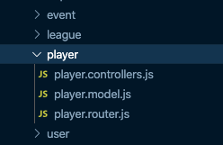

Another benefit of building the backend as a REST API is the ability to test each endpoint. Figure \ref{postman} shows an example of a simple request to return data for a specific league, which has successfully returned the desired JSON data. This testing was performed using a tool called **Postman**.

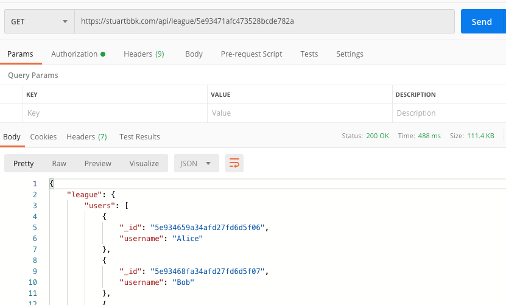

This design also made sense when considering the necessary business logic. In the context of this application, the only time the server should be pushing data to clients which have not submitted a request, is after some change has been made to the database. This might be after a new bid, or bidding on an auction item has ended. However, data should never be emitted to all auction participants in the event of a failed bid, or before the bid has been successfully registered in the database. There is no client-to-client communication required or desired, as might be the case for a simpler application like a chat room. With this in mind, implementing all of the business logic in the form of a REST API, and emitting updated data to clients as a side-effect using Socket.IO, seemed like a good solution.

### Login System

The REST API routes needed to be protected so that only authenticated users could gain access. This is true of almost every REST API, so rather than design a login system from scratch, an implementation was copied from the repository[@api_design_repo] for a REST API design course[@api_design_course] available on the FrontendMasters website. Minor edits aside to tailor the solution to this application, the credit for the code in the auth.js and user.model.js files belongs to the teacher of said course, Scott Moss.

The login system solution generates a **JSON Web Token** on each login or account creation, and returns that token to the client. The client must then use this token to authenticate themselves when accessing any other resources.

### Socket.IO Integration

The Socket.IO library offers features for organising and managing sockets in an application using **namespaces** and **rooms**[@socketio_rooms].

Namespaces allow for separation of concerns between communication channels in an application. In this application, only one namespace ('leagues') was required, but if it was later decided to, for example, add a chat room to the home page, this could exist in a separate namespace, keeping the logic for different parts of the application separate.

Each namespace can contain several rooms. In this application, a separate room exists for each league, allowing the server to push messages to all clients in the room after some database action has been performed. This ensures that all clients have the most up-to-date representation of the league state, without them having to request it manually.

### Data Model

Although a design for the data model had already been sketched out during the design phase, there were still some decisions to make relating specifically to the MongoDB implementation. In MongoDB parlance, there are **collections** and **documents**. A collection can be considered analogous to a table in a relational database, and a document is a record within that collection. Each document is assigned a unique **object ID**, which acts like a primary key in a relational database table. An example of a collection from this application is **players**, and each document within that collection represents a single player, as seen in figure \ref{collection}.

 
 
MongoDB offers two different methods for modelling relationships between documents:

* **Document References**[@mongo_ref] - this approach uses references to object IDs to describe the relationship. This is similar to the way that a foreign key references a primary key in a traditional relational database. The main benefit to this approach is that it avoids duplication of data, but with the trade-off that data from multiple collections may be needed to satisfy a query.
* **Embedded Documents**[@mongo_embedded] - this method instead sees documents stored within other documents. With this approach, duplication of data may occur, but the number of read operations required to retrieve a document is minimised.

It is not always immediately obvious which approach is most suitable. Only with a strong understanding of how the application is going to use the data can an informed decision be made. Developers with more experience working with traditional relational databases may be attracted to the document references approach, but this can make life difficult when working with MongoDB.

During the early stages of development, most relationships were modelled using the document references approach, but problems arose when it was necessary to update multiple documents in a single transaction. In order to ensure that there is no unintended behaviour, updates relating to the live auction must be performed in a single transaction, with no other operations interleaved. Although MongoDB does offer multi-document transactions, the documentation[@mongo_transactions] states:

> In most cases, multi-document transaction incurs a greater performance cost over single document writes, and the availability of multi-document transactions should not be a replacement for effective schema design. For many scenarios, the denormalized data model (embedded documents and arrays) will continue to be optimal for your data and use cases.

With this advice in mind, the schema was redesigned to use more embedded documents. All of the smaller subcomponents of the auction were added as embedded documents rather than references, and this made updates significantly more straightforward.

Use cases for the document references approach still remained however - for example, modelling the relationships between the players collection and individual auctions. The full player list used for this application contains 619 players, and cannot be altered by the application. Therefore, there were no concerns regarding atomic update operations, so document references could be used to avoid duplicating all 619 player documents for every auction.

The code for creating the schemas and performing database operations was done using a Node.js library called **Mongoose**. Mongoose is an object data modelling library, which allows the developer to focus on modelling their data without concerning themselves with the complexities of the MongoDB query language. The resulting code is more readable, and allows the developer to easily see the structure of the data they will be working with. The code snippet below shows the schema for the current live auction item: 

```javascript
import mongoose from 'mongoose'
import { bidSchema } from './bidSchema'

export const liveAuctionItemSchema = new mongoose.Schema(
  {
    player: {
      type: mongoose.SchemaTypes.ObjectId,
      ref: 'player',
      required: true
    },
    bidHistory: [
      {
        type: bidSchema
      }
    ],
    currentHighBid: {
      type: Number,
      required: true,
      default: 0
    },
    currentHighBidder: {
      type: mongoose.SchemaTypes.ObjectId,
      ref: 'user'
    }
  },
  { timestamps: true }
)
```

It demonstrates the use of both document references (the **player** and **currentHighBidder** fields), and embedded documents (the **bidHistory** field).

### Auction Overview

Implementing the server-side logic for the auction was the most challenging part of the development process. There are six stages to the auction, each of which is sufficiently complex as to warrant its own section for more detailed discussion:

1. League creator starts the auction.
2. A user selects a player to be the next auction item.
3. Real-time bidding begins.
4. A countdown timer begins after the first succesful bid, and is reset after every subsequent successful bid.
5. When the countdown timer reaches 0, the player sale is finalised.
6. Steps 2-5 are repeated until all squads are complete, at which point the auction is finalised.

### Starting the Auction

Once enough users have joined a league, the league's status field will be set to 'ready'. Only once the league is in 'ready' state, will the league creator be permitted to start the auction. When the creator sends a successful request to the server to start the auction, some database updates are processed:

* League status is moved from 'ready' to 'auction'.
* The embedded auction document is prepared with the appropriate users and saved to the league document, as seen in the snippet below.

```javascript
const auctionUsers = league.users.map(u => {
  return { user: u, squad: [], budget: defaultValues.startBudget }
})
league.status = 'auction'
league.auction = {
  auctionUsers,
  soldAuctionItems: [],
  liveAuctionItem: null,
  nextUser: user
}
await league.save()
```

The above snippet demonstrates another advantage of using the Mongoose library introduced in the previous section. It is possible to manipulate a document using JavaScript, before calling the `save()` method on the document to persist the changes to the database. This can often make for more readable and maintainable code than the equivalent operation using the MongoDB query language.

After a successful database update, a message is emitted to all users in the league via Socket.IO, ensuring that all clients receive a real-time update informing them that the auction has begun.

### Nominating a Player

The participant whose turn it is to nominate a player must do so by submitting a request. Upon receiving this request, the server must perform some checks, to ensure that:

* The request was received from the expected authenticated user (the user referred to by the **nextUser** field in the auction document).
* The user is permitted to bid on this player (club and position constraints checked).

Assuming the request is successful, the **Auction** document is updated with a newly generated **LiveAuctionItem** embedded document, with the current user set as the highest bidder (with a bid of £0).

At this point, a countdown timer is triggered on the server - this is explained in more detail in a later section.

In addition, a message is emitted to all league users in real-time, and bidding begins.

### Bidding

Given the real-time nature of the auction with bidding open to multiple users, the server must handle multiple users attempting to bid on the player simultaneously, without compromising the integrity of the data.

On receiving a bid, the server must only accept it if:

* The user is permitted to bid on this player (club and position constraints checked).
* The user has sufficient budget.
* The user is not already the highest bidder.
* The bid amount is strictly greater than the existing highest bid.

The last check on this list is the one which can be expected to fail in instances of two users attempting to bid at the same time. When a bid is unsuccessful, an error response is returned to the bidder, and no updates relating to the failed bid are emitted to other users.

For successful bids, database changes are required. The **LiveAuctionItem** document is updated with the new highest bidder, highest bid amount, and a new **Bid** document is appended to the array representing the bidding history.

At this point, the countdown timer is reset, a message is emitted to all league users to inform them of the succesful bid, and bidding continues.

The difficult part of the above process is ensuring that constraints are checked and the database is updated in one atomic transaction. In an earlier section, a benefit of using Mongoose was discussed: the ability to manipulate documents as if they were plain JavaScript objects, with updated documents persisted to the database using the `save()` method. Unfortunately, such an approach does not guarantee atomicity. In the milliseconds between the original document being retrieved from the database, and the edited document being saved, it is possible that a new bid could arrive. This new bid could have constraints checked against the out-of-date document in the database, and this may lead to a bid being incorrectly accepted.

Therefore, it was necessary to use the `findOneAndUpdate()` method available on all Mongoose models, to perform validations and updates in a single atomic transaction. The resulting code snippet, appended below, is far less readable than the previous snippet, but this was a necessary evil to ensure that the integrity of the data does not become compromised when faced with multiple competing bids.

```javascript
const league = await League.findOneAndUpdate(
  {
    _id: leagueId,
    status: 'auction',
    users: { $eq: user },
    'auction.liveAuctionItem._id': auctionItemId,
    'auction.liveAuctionItem.currentHighBidder': { $ne: user },
    'auction.liveAuctionItem.currentHighBid': { $lt: amount }
  },
  {
    'auction.liveAuctionItem.currentHighBid': amount,
    'auction.liveAuctionItem.currentHighBidder': user,
    $push: { 'auction.liveAuctionItem.bidHistory': { user, amount } }
  },
  { new: true, useFindAndModify: false }
)
```

The first argument to the `findOneAndUpdate()` method above is an object containing query filters, and the second argument is an object containing update instructions. It can be seen that one of the items in the query filters object compares the current high bid amount to the new bid, with a `$lt` (less than) operator. This means that if a higher (or equal) bid has already been registered, the query will find no results, and no erroneous attempt to update the document will be made.

Not all constraints must be checked by this single operation, though. Some of the validations can be performed in advance (club, position and budget), so they are not shown in the snippet above. Only those validations which are extremely time sensitive are included in the atomic `findOneAndUpdate()` operation.

### Countdown Timer

A successful bid on a player triggers a countdown timer, starting at 10 seconds. Any subsequent successful bid resets this timer back to 10 seconds. After 10 seconds of inactivity (no new bids), the sale is finalised.

Node.js features a convenient built-in function called `setInterval()`, which accepts two non-optional arguments: a function to be executed repeatedly, and a number representing the delay between executions of said function. A related function, `clearInterval()` is also provided, to allow the application to terminate the repeated execution initiated by `setInterval()`. Both of these functions were required for the countdown timer:

* `setInterval()` is called each time a new bid is successfully registered, to start a new countdown timer at 10 seconds.
* `clearInterval()` is used to ensure that old countdown timers are terminated.

A code snippet detailing the use of these functions can be seen below. Some details are redacted for the sake of clarity; the complete version can be seen in the `startCountdown()` function in the auction.js file.

```javascript
let count = defaultValues.countdownTimer  // 10 seconds
const countdown = setInterval(async () => {
  const league = await checkBidIsHighest(leagueId, auctionItemId, amount)

  if (!league) {
    return clearInterval(countdown)
  }

  count -= 1
  if (count <= 0) {
    clearInterval(countdown)
    // Redacted: some code to finalise sale of player
  }

  socketIO.to(leagueId).emit('countdown', count)

}, 1000)
```

The snippet above handles the following sequence of events, which occurs for each successful bid:

* The `count` variable is initialised to 10 seconds.
* A call to `setInterval()` initiates the repeated execution of a function to be called every 1000 milliseconds.
* Inside the function, the database is queried to check that this bid is still the highest bid.
* If the check fails, this means a higher bid has subsequently been received, and `clearInterval()` is called to terminate the countdown timer for this outdated bid.
* If the check instead confirms that the bid is still the highest, execution of the function continues. The countdown timer is decremented by 1 second.
* If the countdown has not yet reached 0, the value of `count` is emitted to all league users.
* If the countdown has reached 0, `clearInterval()` is called to prevent further executions of this function, and some code to finalise the sale of the player is called.

### Auction Item Sold

Once the countdown timer reaches 0, the player sale is finalised. This process involves a significant amount of data manipulation:

* The winning bidder's squad and budget are updated to reflect the sale.
* The player sold is added to the array of sold items.
* The current live auction item is set to `null`.
* The next user to nominate a player is selected (this is fairly complex as it involves checking to see which users still have incomplete squads).

A check is also completed to determine whether this player sale signifies the end of the auction, but for the purposes of this section, it is assumed that this is not the case. The completion of the auction is discussed in the next section.

In the **Bidding** section above, it was established that care must be taken to ensure that no new bids are registered while database updates are in progress. This remains true when finalising the player sale, but the data manipulation required for this step was prohibitively complex to consider implementing as a single atomic update operation, so an alternative approach was taken.

Before beginning the complex updates, a single atomic update operation to set the league status from 'auction' to 'locked' is executed, blocking any new bids. For the length of time that the league status is set to 'locked', complex updates can be performed using JavaScript, in the manner demonstrated in the **Starting an Auction** section. These updates are not atomic, but it doesn't matter as no other database operations are permitted when the league status is set to 'locked'. Once the updates are complete, the league status is set back to 'auction', so that the auction can continue.

Two separate messages are emitted to all league users during the above process. The first message is sent as soon as the league is locked to confirm the sale. A second message is sent 3 seconds later to indicate that the next player should be selected for auction. This delay is deliberate to enforce a short pause between one auction item ending and a new one beginning. There is no technical reason which necessitates this delay (the database updates take only milliseconds), but rather it is implemented for reasons relating to the user experience.

### Auction Complete

After all squads are completed, some further data manipulation is completed to finalise the auction. Due to the use of the 'locked' status introduced in the previous section, this process is fairly straightforward from a technical standpoint, with no potential for conflicts. The following updates are made to the league document:

* The status field is set to 'postauction', to indicate that the auction is complete.
* Some new data structures are created to prepare for the next stage of the game, based on the results of the auction:
  * A new embedded document to track data relating to each user's points scored and their rank in the league.
  * Contained within this document for each user, an additional embedded document for each player in their squad, to track points scored by individual player.

At this stage, all scores are initialised to 0, but once the event (round of real-life football fixtures) is underway, these will be updated.

### Post-Auction Points Scoring

For the game to display updated points based on real-life football data, this would require either that an administrator manually updates scores, or that the application has the ability to consume data from a third party football statistics API. At this time however, the application simply generates random points every few seconds, to simulate events. The result is that the points scoring portion of the game lasts for only about a minute rather than hours or days, as it would if played for real.

The sequence of events for this randomly generated points-scoring process is as follows. Most steps would remain the same for a version which used real data.

* An administrator triggers the simulation of an event by sending a POST request to the server.
* The event's status is updated to 'live'.
* Points for each player are randomly generated every 3 seconds, and the **Event** document is updated accordingly.
* After each event update, a message is sent to each **League** which is using this event to track its points-scoring.
* For each league, individual player points are taken from the event data, and total score for each league user is calculated by summing points for each player in their squad. Live updates are pushed to each league user via Socket.IO messages.
* After the final points update, the event status is set to 'complete', and all leagues tracking this event are also set to 'complete'. One final update is pushed to each league user, confirming the completion of the game.

Any league which has not yet completed its auction at the time of the event starting is automatically cancelled.

## Frontend

The client-side code is responsible for presenting a graphical user interface, based on data received from the server. This involves a lot of complex state management to ensure that the user is viewing the correct information. This will be explored later in this section, but first it is important to understand the application from the user's perspective, so this will be discussed first.

### User Interface Overview

The user interface consists of:

* The **title bar**, with the name of the application, the user's login status, and a logout button. On smaller screens, there is also a hamburger menu button in the top left.
* A **sidebar menu**, to allow the user to navigate between different parts of the application.
* The **main content** area, which is everything below the title bar and to the right of the sidebar menu.

All screenshots in this section will show the version for smaller screens. There is no difference other than how the sidebar menu is presented. In this context, 'smaller screen' means a tablet or small laptop. The application has not been designed to function on smaller devices such as phones.

The design of the user interface can be seen in figures \ref{uinomenu} (menu not visible), and \ref{uimenu} (menu visible).

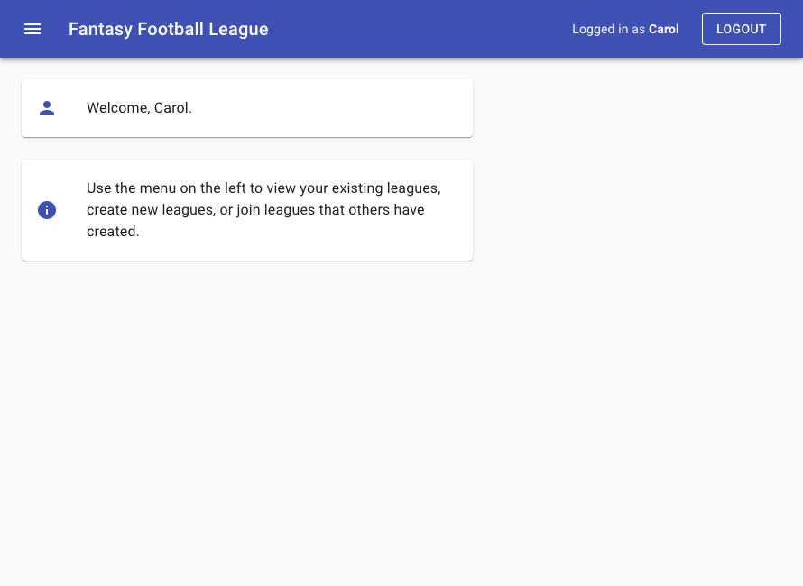

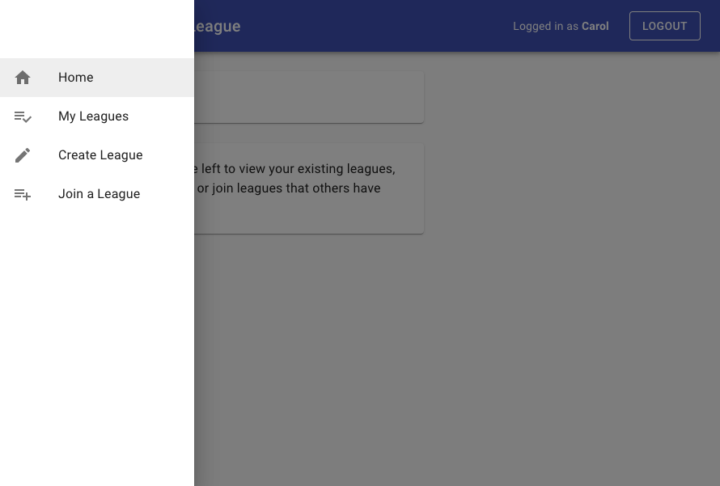

The available options in the sidebar menu are:

* **Home** - a welcome page with some instructions on how to navigate the application.
* **My Leagues** - for the user to browse leagues they have created or joined, shown in figure \ref{myleagues}.
* **Create League** - for the user to create a new league, shown in figure \ref{create}.
* **Join a League** - for the user to browse leagues created by others which they may join, shown in figure \ref{joinleague}.

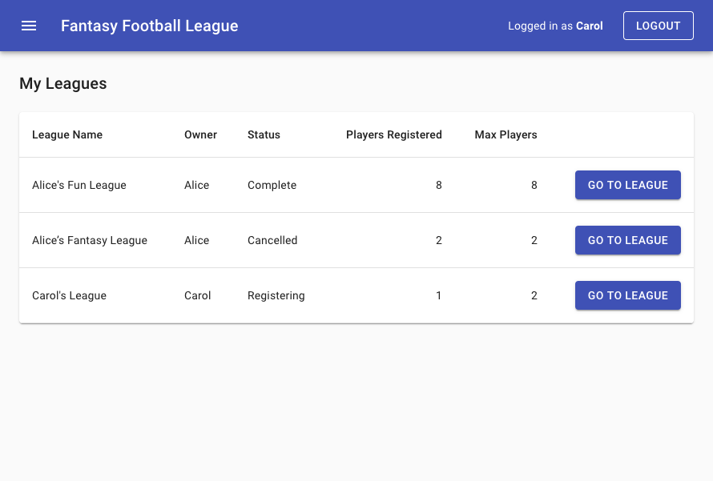

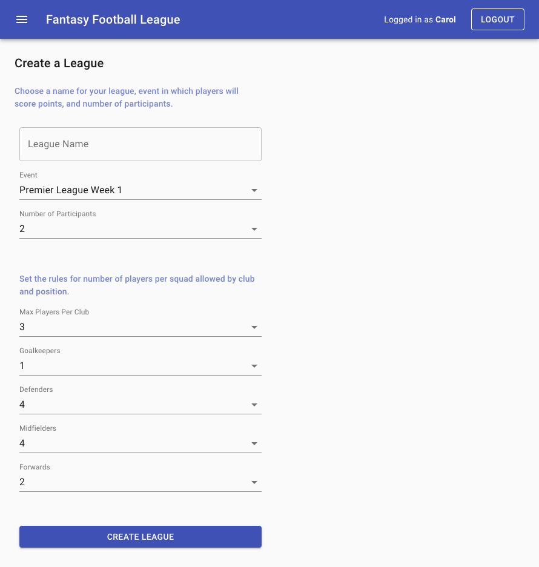

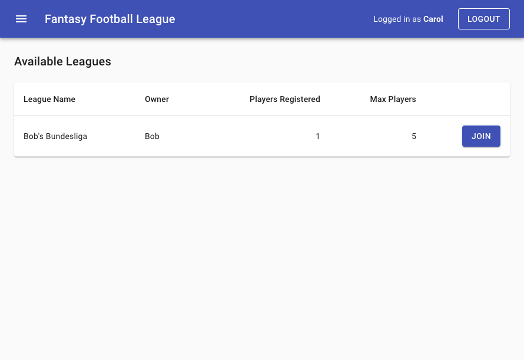

Once created, each individual league has its own **League Home** page. This can be accessed either immediately after creating or joining a league, or later from the **My Leagues** page. The information on the **League Home** page depends on the stage of the game:

* Waiting on more users to register, shown in figure \ref{waiting}.
* League registration complete, but auction not yet started, shown in figure \ref{ready}.

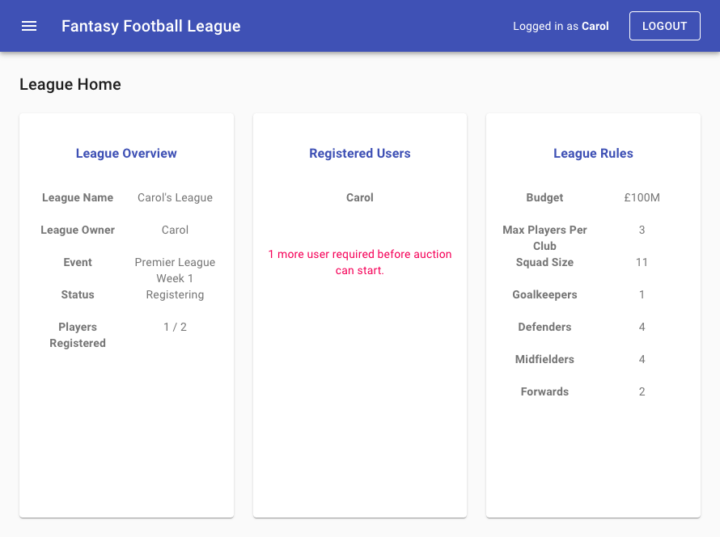

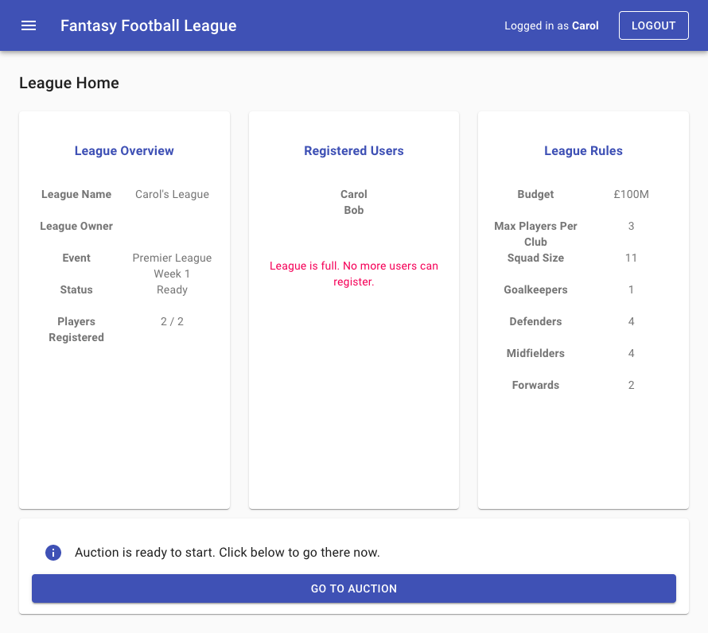

Once the auction is in progress, any registered user who visits the league home page will be automatically redirected to the **Auction** page.

Each round of bidding in the auction begins with one user nominating a player. The user whose turn it is to nominate a player selects from the menu shown in figure \ref{nominate}. All other users are informed that this is the case, as seen in figure \ref{waiting2}.

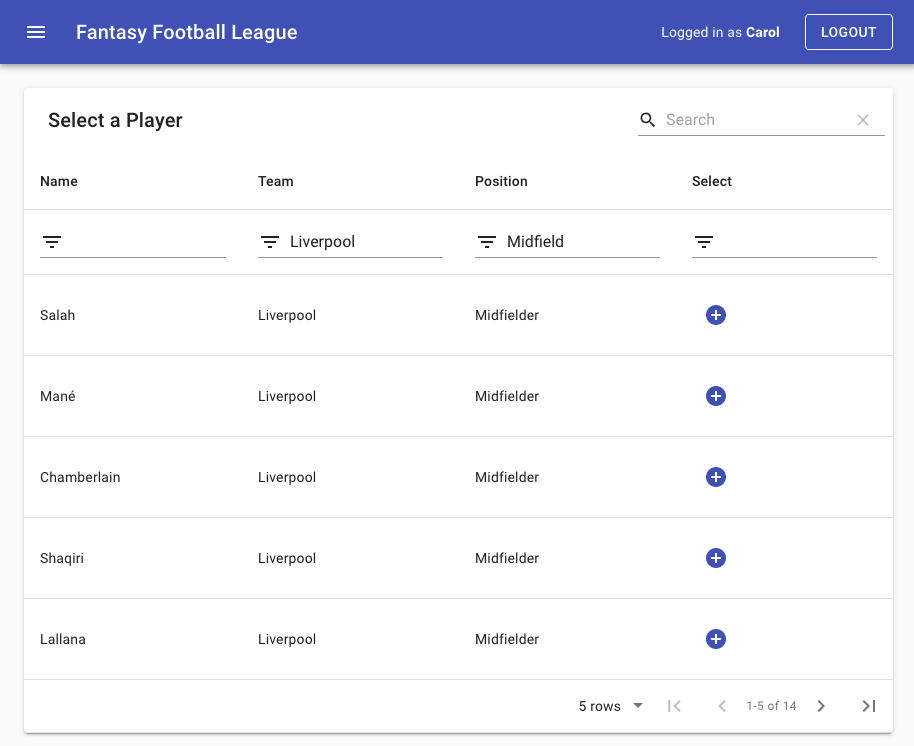

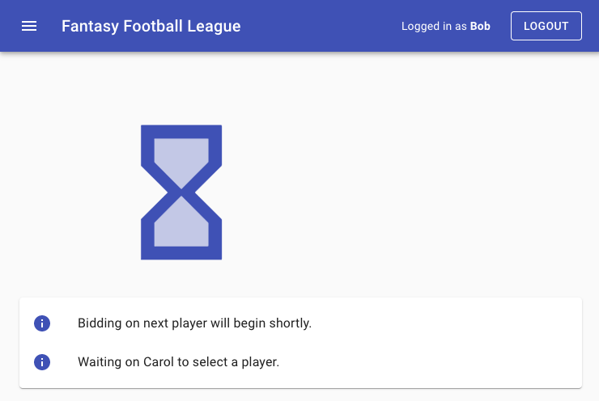

Once a player has been nominated, bidding begins, and the main user interface for the auction is shown to all users (figure \ref{auction}). This is quite a busy user interface, with a lot of information for the user to digest. It is potentially quite daunting for new users, but ultimately it was considered necessary to make as much information as possible available at-a-glance, to allow users to strategise appropriately. There are six separate panels, each of which serves a specific purpose:

* **Bid History** (top left in main auction UI). This shows a list of all bids on the current player. The list is scrollable if there are a lot of bids.
* **Current Auction Item** (top middle). This lists some pertinent details relating to the current player for sale: the player's name, club, and position. It also shows the current high bid and bidder.
* **Countdown** (middle left). This displays a countdown from 10 seconds to 0 seconds, letting the user know how long they have if they wish to make a new bid. If a new bid is made, it displays a graphic which makes this clear to all users. This graphic is shown in blue to the user who made the bid, and red to all other users (seen side-by-side in figure \ref{newbids})
* **Bidding Status** (middle). This lets the user know whether or not they are permitted to bid on the current player. If they are not permitted to bid, the reason why will be displayed. In the example shown in figure \ref{status}, the user cannot bid because they already have too many players from the same club.
* **Bidding Controls** (bottom). The user is given a slider and a button to allow them to bid. The size of the increment on the slider increases dynamically with the size of the current highest bid, to avoid a very slow auction in which bids increase very slowly. These controls will be automatically disabled if the user is not permitted to bid for any reason.
* **Auction Sidebar** (right). This is where the user can view more detailed information on certain aspects of the auction, which would be too cumbersome to have permanently on display. By clicking the **Change View** button, the user can view whichever information they consider pertinent at the time in the sidebar. They can select from:
  * **Budget Summary** - contains a list showing each user's remaining budget.
  * **Squads** - contains details on each user's current squad. From within this section, the user can then cycle through each user. This is shown in figure \ref{squads}.
  * **Available Players** - contains the list of players not yet auctioned off.
  * **Sold Players** - contains a list of previously sold players, which user bought them, and how much they paid.
  * **League Rules** - a list of rules relating to squad composition.

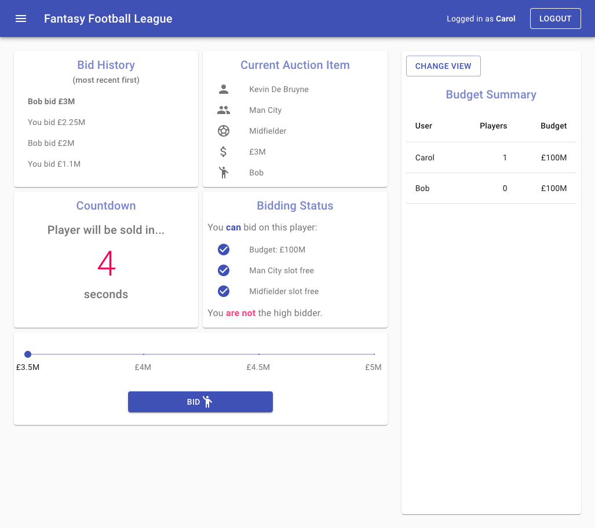

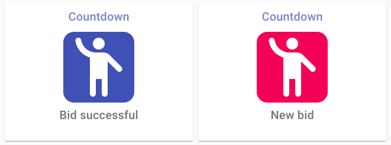

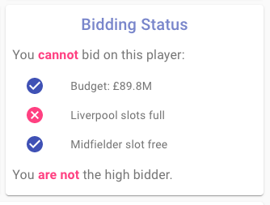

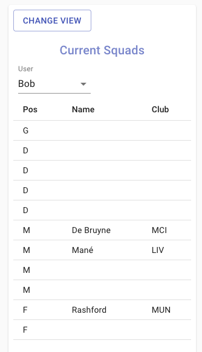

The main auction UI remains on display until the countdown timer reaches 0, at which point the player is sold to the highest bidder. When a player is sold, a page confirming the player sale is shown to the user for a few seconds (figure \ref{sold}) before the next player is selected for bidding.

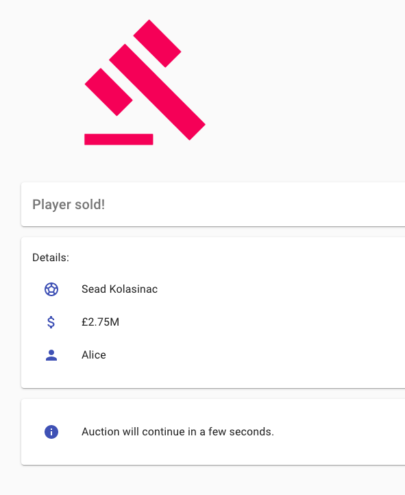

Once the auction is complete, users are taken back to the **League Home** page, which now allows users to view league standings and points scored by players in each team. The version of this page which is displayed after the auction is complete, but before the event has begun, is seen in figure \ref{postauction}. The version shown while the event is live is shown in figure \ref{live}, and the final standings are shown in figure \ref{final}. All versions of this page allow the user to click on any user in the league standings (in the left panel), and the right panel will display the player points breakdown for that user. The final standings and player points remain available for all users in the league to browse indefinitely, but no further interactions are possible at this point - this is the end of the game for this league.

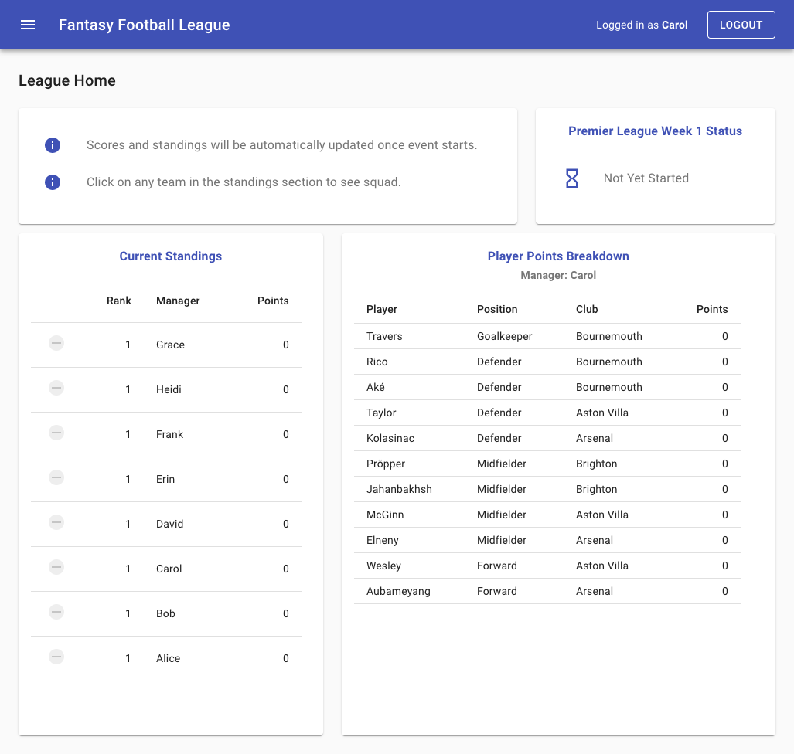

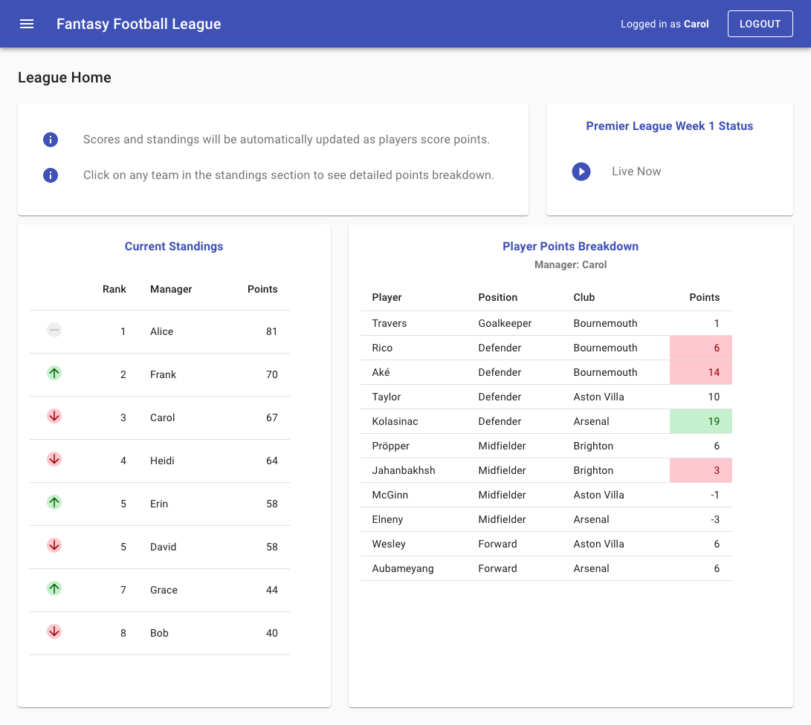

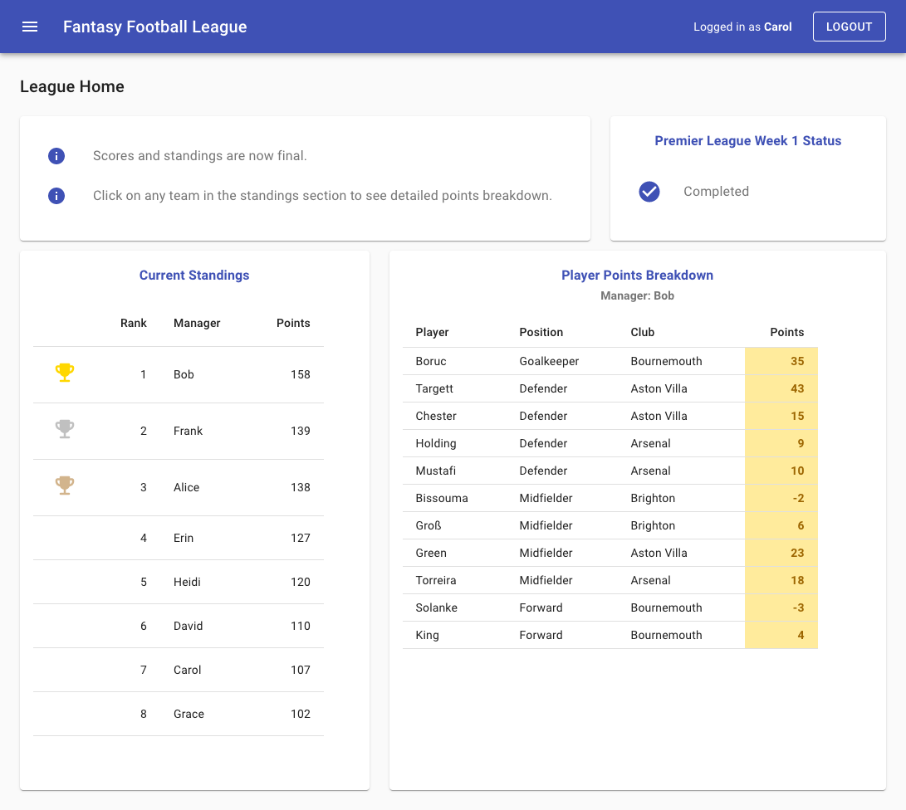

### React Application User Interface

A React single page application consists of a single HTML page with an empty body, and JavaScript code which dynamically renders HTML based on the state of the application. React makes use of an XML-like syntax called **JSX** to allow developers to write JavaScript functions which appear to be returning HTML, although in reality this JSX is transpiled to plain JavaScript which the browser can interpret. These functions which appear to be returning HTML are called **components** and they are the building blocks of a React user interface. The most basic React application possible is shown below. It consists of one component called **App**, which returns a single HTML paragraph:

```JavaScript
import React from 'react'
import ReactDOM from 'react-dom'

const App = () => <p>Hello World!</p>

ReactDOM.render(<App />, document.getElementById('root'))
```

Components can also return other React components, and this is how complex user interfaces are composed. A very basic example of this can be seen below:

```javascript
const MyComponent = () => <p>Hello</p>
const AnotherComponent = () => <p>World!</p>
const App = () => (
  <div>
    <MyComponent />
    <AnotherComponent />
  </div>
)
```

In this application, a UI components library called **Material UI** was utilised. This allowed the developer to import ready-styled components into the project, rather than  manually build custom components using HTML and CSS. The code for one of the most simple components in the application is shown below, featuring two imported Material UI components:

```javascript
import React from 'react'
import Typography from '@material-ui/core/Typography'
import CircularProgress from '@material-ui/core/CircularProgress'

const Loading = () => (
  <div>
    <CircularProgress color="primary" />
    <Typography>Loading...</Typography>
  </div>
)

export default Loading
```

This component can be rendered elsewhere in the application by importing it and returning `<Loading />`.

Constructing a web application in such a convoluted way would be rather pointless for static content. The power of React comes from its state management tools, which will be explored in the following section.

### State Management in React

Broadly speaking, there are two types of state in React:

* **Local state.**
* **Global state.**

Local state exists in individual components. A typical use case for local state might be to keep track of whether the user currently has a certain form element selected. This is information that is important for this component to know about, but is not of interest to the wider application. Items of local state can be passed down to subcomponents. For example, in this application it would have been possible for state to be passed down from the **AuctionHome** component, to the **AuctionLive** component, to the **AuctionSideBar** component, and so on. However, this pattern can quickly become very messy, and when there is an item of state which many components need access to, it is better to store it as global state.

Despite the name, global state does not have to exist at the application level. It can exist for a specific part of an application only, and any components in that part of the component tree can access it, without it having to be explicitly passed down between each level.

Both types of state were used in this application, but for data returned from the server such as auction data, this was stored in global state, to allow access to the many building blocks of the auction user interface.

### Conditional Rendering in React

The purpose of managing state is to allow the application to determine which UI components to render. An example of this in action can be seen in the below code snippet taken from AuctionHome.js:

```javascript
import React, { useContext } from 'react'
import { LeagueStateContext } from '../../contexts/LeagueContext'
import AuctionNotReady from './AuctionNotReady'
// Remaining imports redacted

const AuctionHome = () => {
  const { league } = useContext(LeagueStateContext)
  const { status, itemSold } = league

  return (
    <>
      {status === 'registering' && <AuctionNotReady />}
      {status === 'ready' && <AuctionReady />}
      {status === 'auction' && !itemSold && <AuctionLive />}
      {status === 'auction' && itemSold && <AuctionItemSold />}
      {(status === 'postauction' || status === 'complete') && (
        <AuctionFinished />
      )}
    </>
  )
}

export default AuctionHome
```

When the user visits the auction page for a certain league, the application checks the status of the league at that time, and determines which page the user should be shown. For example, if the status is 'ready', the `AuctionReady` component, which has been imported from another file, will be rendered. 

The first line of code inside the component shows a call to `useContext()` - this function is part of the React API, and allows components to access a certain part of global state (in this case, the specific league in question). The second line uses object destructuring to gather only the parts of the league object which are of relevance. Finally, there is a return statement which renders only the appropriate component. Variations of this pattern occur in several places throughout the frontend application.

### React Project Structure

As React is a library rather than a framework, it is up to the developer to structure their project in whichever way they prefer. The structure for this project can be seen in figure \ref{frontend_project}.

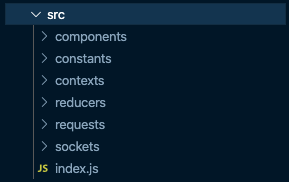

This structure has the effect of separating files by what purpose they serve, rather than which part of the application they belong to. Definitions are as follows:

* **index.js** - the entrypoint for the application.
* **components** - UI building blocks.
* **constants** - hardcoded values which should not change.
* **contexts** - this is where any global state is managed, components can access these state providers using `useContext()`.
* **reducers** - a reducer is a function which receives the previous state and an action, and returns the new state. These are useful for some of the more complex state management tasks in the application.
* **requests** - contains all requests to the REST API made from the frontend.
* **sockets** - code for managing the real-time updates via Socket.IO belongs here.

The **components** directory is further split into sub-directories. For example, there is a sub-directory for **league**, and further sub-directories within league for components depending on whether they are needed before or after the auction. Such decisions are a matter of preference and do not affect the functionality of the application. The approach taken here seemed like a reasonable middle ground between a massively nested directory structure and having too many files in one folder.

### Live Updates

Ensuring that the user always has the most up-to-date data for their league was key to providing a good user experience.

When the user visits the URL for their league (https://stuartbbk.com/myleagues/<:leagueId>), the following code (LeagueContainer.js) is called:

```javascript
const LeagueContainer = ({ match }) => {
  return (
    <LeagueProvider leagueId={match.params.leagueId}>
      <LeagueHome />
    </LeagueProvider>
  )
}
```

This pattern ensures that `<LeagueHome />` and all of its descendants have access to league data. `LeagueProvider` is defined in LeagueContext.js. Within this function, code to perform an initial request for data is executed, after which the user establishes a Socket.IO connection on which they will receive any future pushed updates. The following snippet from within the `LeagueProvider` function demonstrates this:

```javascript
useEffect(() => {
    // some code to request initial data redacted
    const socket = leagueSocketListener(leagueId, dispatch)
    return () => socket.disconnect()
  }, [leagueId, user._id])
```

The `useEffect()` function is part of the React API, and is the preferred way to perform side effects in React. The first argument is a function with actions to be performed, and the second argument is a dependencies array. The idea is that values in the dependencies array are monitored by React, and the function is executed any time the values of the dependencies change. In this case, neither the league ID nor user ID will change while the user still has the league page open, so the function will only be executed once. The code to request the initial data is not especially interesting so has been redacted, but after this, the user joins the Socket.IO room for their league. They will receive live updates from the server for as long as they are connected to this socket. Finally, the function passed to `useEffect()` can optionally return a function, which is called when the user leaves the page. In this case, when the user closes the tab, or browses away from this league, they will close the socket and no longer receive updates.

The `leagueSocketListener()` function called in the above snippet performs two functions:

* Connects to the relevant league room.
* Listens for events emitted by the server.

The code with most of the event listeners redacted (because they are very similar) is shown below:

```javascript
import io from 'socket.io-client'
import rootUrl from '../constants/rootUrl'

const socketIoUrl = rootUrl + 'leagues'

const leagueSocketListener = (leagueId, dispatch) => {
  const socket = io.connect(socketIoUrl, {
    query: `leagueId=${leagueId}`
  })
  
  // an event listener, others are redacted
  socket.on('opening bid', data => {
    dispatch({ type: 'SOCKETIO_OPENING_BID', data })
  })

  return socket
}

export default leagueSocketListener

```

The event listener shown contains code which should be executed if an event called 'opening bid' is received from the server. The `dispatch()` function sends a message to the reducer with the action type and updated state. When the league's state is updated, any components which are accessing league data using `useContext()` are automatically re-rendered, thus achieving the desired effect of live updates in the UI.

### Frontend Performance

When application state changes, React has to create new DOM (Document Object Model) nodes for display in the browser. This caused a problem in one part of the application only, and required a technique specifically designed to deal with this problem. The problem was with the full list of players shown in the sidebar, which can be seen in figure \ref{playerlist}.

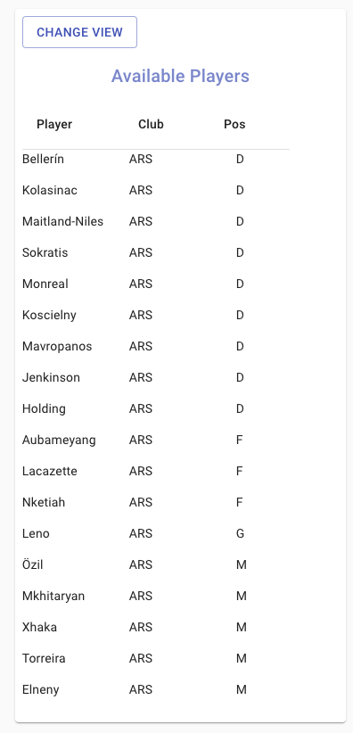

Although only 18 rows are visible in this table, it is scrollable, so the user can browse all 619 players. The naive way to implement this feature is to render the entire table at once, but with this approach, a delay of approximately 1 second was introduced. In an application which is otherwise very responsive to user clicks, this was quite jarring, so a solution was found using a library called **react-window**. This library uses a technique called **virtualisation**. The documentation[@react_window] states:

> React window works by only rendering *part* of a large data set (just enough to fill the viewport). This helps address some common performance bottlenecks.

This is exactly what was required for the player list. After integrating this library, only those players whose rows were visible had DOM nodes allocated, then the DOM is updated dynamically as the user scrolls. The results were exactly as hoped: it now appears to the user that the entire scrollable table has been loaded instantly.

## Deployment

For a multiplayer game which relies on real-time bi-directional communication, it is important to test that data transmission over the Internet is fast enough to provide a good user experience. Therefore, deployment to a server was necessary.

The server chosen in this case was a Digital Ocean Droplet. **Digital Ocean** is a cloud infrastructure provider, and the **Droplet** is one of their products - a virtual private server, running Ubuntu in this case. With access to the Droplet gained via **SSH** (Secure Shell), all of the required tools and libraries were then installed.

Some small tweaks to the code were required before it could be deployed. The React code was transpiled using Babel to create a production build, and the backend code was edited to return the index.html created by this build process. This index.html page links to the transpiled and minified React code for execution on the user's machine.

With the production code ready for deployment, next it was necessary to install the **PM2** library. This allows the server to run Node.js applications in the background. In figure \ref{pm2}, it can be seen that the application has been online for 36 days:

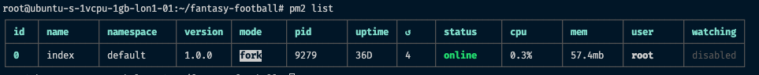

Finally, the **Nginx** web server was set up to receive HTTPS requests, and forward them to the application. A domain (stuartbbk.com) was also purchased and pointed to the public IP address of the server. The application is therefore live at https://stuartbbk.com/, at the time of writing.
