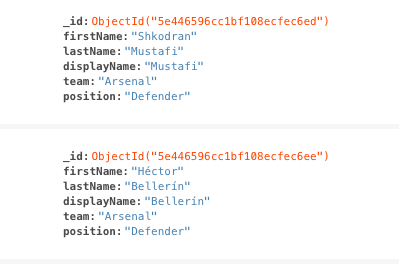

\newpage
# Implementation

## Technology Stack

The MERN Stack was chosen to develop this application:

* **M**ongoDB - a NoSQL database management system.
* **E**xpress - a Node.js web application framework.
* **R**eact - a JavaScript library for building user interfaces.
* **N**ode.js - a JavaScript runtime capable of executing JavaScript on a server.

In addition, the Socket.IO library was selected in order to facilitate the required real-time bi-directional communication between client and server.

Part of the motivation for choosing this stack was its popularity. There are several benefits to choosing a popular techonology stack:

* If a stack has become popular, it is likely that the technologies work well together.
* If any problems are encountered, it is likely that somebody else has encountered the same problem before.
* Libraries and documentation are likely to be regularly maintained.

That said, some further research was conducted to ensure that this was the right stack for this particular application, and the findings follow.

### React

The developer was already comfortable with React prior to beginning this project, and was satisfied that it would fulfil the requirements. Therefore, no alternatives were researched. React user interfaces are composed of components which are updated when the data changes, which is exactly what was needed for this application. For example, when a new bid is made during the auction, the entire page should not update, but only those elements which are relevant.

React is a library, as opposed to a fully-fledged framework (such as Angular). It does not make assumptions about the rest of the technology stack[@react_home]. This was particularly attractive in this case, as there were unlikely to be any problems integrating whichever libraries were required for real-time bi-directional communication.

### Node.js

The most obvious benefit to choosing Node.js for the backend is the convenience factor of writing the same language for server-side code as used for client-side code. Switching between languages involves some cognitive overhead on the part of the developer, and avoiding this should lead to a more efficient development process.

Using Node.js in web applications also opens up the possibiliy for code re-use across different parts of the application. For example, in this application it seemed likely that both client and server side code might have to perform a function such as filtering a list of players down to only those which haven't been auctioned off yet.

In the previous section, JSON (JavaScript Object Notation) was identified as the format for data transfer. This makes Node.js a particularly convenient choice - as the name suggests, JSON can easily be converted to JavaScript objects (and vice versa). The developer can spend less time worrying about the appropriate data structure to represent the data, and more time thinking about how to implement the business logic.

The above reasons made choosing Node.js attractive from a developer experience standpoint, but most importantly, research also showed that Node.js was a popular choice for applications which require constantly updated data such as chat rooms and games. Requests are processed asynchronously without blocking the thread, which means that it is capable of short response times, a necessity for this application.

The main drawback to choosing Node.js seemed to be that it could experience performance bottlenecks for computationally heavy tasks, but this was not a concern for this application.[@nodejs_good_bad]

### Socket.IO

Upon learning about Socket.IO, it was clear that this was exactly the library for use in this application. It offers support for event-driven real-time bi-directional communication between the client and server, and abstracts away the underlying complexity of implementing WebSockets. This seemed like a good choice, as implementing the appropriate business logic would be complex enough without also worrying about the low-level details.

### Express

Express is the most popular web framework which runs on Node.js, and it is featured in an example in the Socket.IO documentation.[@socketio_express] With support for Socket.IO integretation and the ability to rapidly develop REST APIs, there was little need to explore alternatives to Express.

### MongoDB

While this application could have been successfully developed with a traditional relational database instead, MongoDB seemed like the more appropriate choice for two reasons. 

Firstly, MongoDB is particularly convenient to work with in JavaScript applications. Objects stored in a MongoDB collection are very similar to plain JavaScript Objects in their structure, thus there is no impedence mismatch when representing data from the database in the application.

Secondly, nested data structures seemed more appropriate than tables for the entities required for this application. For example, the idea of an auction containing an array of auction users, and each auction user containing an array of players they've won, made more sense conceptually than having these entities spread across different tables in a relational database.

## Development Process

The development process involved taking one user story at a time, and implementing all that was required to make some minimal functional version of that user story a reality. This would typically involve working with the database, backend application logic and the user interface. At this point, some testing was carried out to ensure the feature was working as intended, and usually a few more similar cycles would follow before the feature could be considered to be working as intended.

Work was completed in approximately the following order:

* Login system for users to create account, log in and log out.
* Funtionality to allow users to create and join leagues.
* The auction.
* The post-auction section.

For each feature, work was typically done on the backend first so that each endpoint was returning to correct data for each type of request it might receive. This made development of the frontend significantly easier.

Some user stories required significantly more work than others. Building a basic login system was relatively straightforward, but building a real-time auction was not. As a result, the more complex user stories would be broken into smaller more manageable chunks - for example, first adding the functionality to allow a user to select a player to be auctioned off, and then only once this feature was working as intended, then beginning work to allow others to make counter bids.

## Development Tools

### Git/Github

Git was used for version control. Typically, code was committed to the repository once any milestone was reached. Sometimes these milestones would relate to a user story, but other times they would relate to a bug fix or some refactoring.

Github offered a centralised storage solution for the Git repository, which made it easy to work on this project on different machines. This was particularly useful when it was time to deploy the application to a production server.

### Visual Studio Code

Visual Studio Code is a feature rich text editor as opposed to a fully-fledged integrated development environment. Some of its useful features can be seen in figure \ref{vscode}.


In the bottom left, a status bar shows that the current working directory is actually a remote server accessed via SSH (Secure Shell). This made working on the development server as simple for the developer as working on the local machine.

The integrated terminal is another useful feature, both for local and remote development environments. In the screenshot a git command is shown, which is only one of many uses for the terminal during development.

Two source code files are shown in the editor, side-by-side. In the left panel, there is client-side code for requesting a list of all available players, and on the right panel there is server-side code showing relating to the player model - the ability to view files side-by-side in this manner is extremely useful during development. In this example, the developer working on the client-side code is able to view the server-side code to learn what data structure to expect in the response.

The code in the screenshot (and all code in the application) is consistently formatted according to rules chosen by the developer. This is handled by an extension for Visual Studio Code called **Prettier**. This frees the developer from having to worry about spacing and indentation - it is handled automatically on each save.

### Postman

Postman is a tool which can be used to test REST API endpoints. For example, once the server side code had been written to allow the user to create a league, Postman was used to send a request to the server in the same format as the one that the client would send. It could then be verified that the league was created correctly in the database, and the correct response sent to the client, before work would begin on the client side code.

### Yarn

Yarn is a package manager for Node.js projects. Most Node.js projects, including this one, involve the use of several libraries. Yarn helps the developer to keep track of which dependencies are required, so that when the code is deployed on a new machine, the process of installing these dependencies is automated. NPM (Node Package Manager) is very similar and would have been a suitable alternative.

### Babel

Babel is a JavaScript transpiler, which allows the developer to write code using the latest JavaScript features without worrying about compatibility issues. Babel will transpile modern JavaScript into a backwards compatible version of JavaScript. This significantly improves the development experience, as several useful features have been added to JavaScript in recent years. 

## Backend

The server side program is first and foremost a REST API. It receives requests from clients, performs the necessary database operations, and returns a response. The real-time bi-directional communication added using Socket.IO is important for the user experience, but it is worth noting that even if this functionality was removed, the application would still work. The user experience would be terrible - they would have to constantly refresh their page during the auction to see if there had been any new bids, but with enough persistence from the users, the auction could be completed correctly. There are many good reasons for this approach, described in the following section.

### REST API

A REST API codebase is typically well-organised and simple for the developer to navigate. There are other ways to structure a project, but in this case, the approach which was taken can be seen in figure \ref{resource}. Each entity (or resource) has its own directory, and within that directory is a file each for **model**, **controller** and **router**:

* The **model** file contains the schema information determining the structure of the objects to be stored in the database.
* The **controller** file contains functions for reading from and writing to the database.
* The **router** file defines how the various types of requests (e.g. GET and POST) are handled.


Another benefit of building the backend as a REST API is the ability to test each endpoint. Figure \ref{postman} shows an example of a simple request to return data for a specific league, which has successfully returned the desired JSON data.


This design also made sense when considering the necessary business logic. In the context of this application, the only time the server should be pushing data to clients which have not submitted a request, is after some change has been made to the database. This might be after a new bid, or bidding on an auction item has ended. However, data should never be emitted to all auction participants in the event of a failed bid, or before the bid has been successfully registered in the database. There is no client-to-client communication required or desired, as might be the case for a simpler use case like a chat room. With this in mind, implementing all of the business logic in the form of a REST API, and emitting updated data to clients as a side-effect using Socket.IO, seemed like a good solution.

### Login System

The REST API routes needed to be protected so that only authenticated users could gain access. This is true of almost every REST API, so rather than design a login system from scratch, an implementation was copied from the repository[@api_design_repo] for a REST API design course[@api_design_course] available on the FrontendMasters website. Minor edits aside to tailor the solution to this application, the credit for the code in the auth.js and user.model.js files belongs to the teacher of said course, Scott Moss.

The login system solution generates a **JSON Web Token** on each login or account creation, and returns that token to the client. The client must then use this token to authenticate themselves when accessing any other resources.

### Socket.IO Integration

The Socket.IO library offers features for organising and managing sockets in an application using **namespaces** and **rooms**[@socketio_rooms].

Namespaces allow for separation of concerns between communication channels in an application. In this application, only one namespace ('leagues') was required, but if it was later decided to, for example, add a chatroom to the home page, this could exist in a separate namespace, keeping the application logic for different parts of the application separate.

Each namespace can contain several rooms. In this application, a separate room exists for each league, so that once a client has subscribed to the room, the server can push messages to the client. The business logic of this application was implemented in such a way that the server pushes messages to all clients in the room after some database action has been performed, to ensure that all clients have the most up-to-date representation of the league state, without them having to request it manually.

Although Socket.IO also allows the client to emit messages to all other clients in the room, this functionality was not used in this application.

### Data Model

Although a design for the data model had already been sketched out during the design phase, there were still some decisions to make relating specifically to the MongoDB implementation. In MongoDB parlance, there are **collections** and **documents**. A collection can be considered analogous to a table in a relational database, and a document is a record within that collection. Each document is assigned a unique object ID, which acts like a primary key in a relational database table. MongoDB does not require that all collections enforce a schema, although in this application a schema was enforced. An example of a collection from this application is **players**, and each document within that collection represents a single player, as seen in figure \ref{collection}.

 
 
MongoDB offers two different methods for modelling relationships between documents, both of which were utilised in this application:

* **Document References**[@mongo_ref] - this method uses references to object IDs to describe the relationship. This is similar to the way that a foreign key references a primary key in a traditional relational database. The main benefit to this approach is that it avoids duplication of data, but the downside is that data from multiple collections may be needed to satisfy a query.
* **Embedded Documents**[@mongo_embedded] - this method instead sees documents stored within other documents. With this approach, duplication of data may occur, but the number of read operations required to retrieve a document is minimised. 

It is not always immediately obvious which method is best. Only with a strong understanding of how the application is going to use the data can an informed decision be made. Indeed, during the early stages of development of this application, it was necessary in one case to undo a lot of work and start over, after it was decided that the wrong approach had been chosen initially. Developers with more experience working with traditional relational databases may be attracted to the document references approach, but this can make life difficult when working with MongoDB.

During the early stages of development, most relationships were modelled using the document references approach, but problems started when it was necessary to update multiple documents in a single transaction. For example, during an auction it might be necessary for an operation to be performed which updates the main auction document, the auction users documents, and the available auction item documents. In order to ensure that there is no unintended behaviour, these updates must be performed in a single transaction, meaning that either all updates are successful or none are, with no other operations interleaved. Although MongoDB does offer multi-document transactions, the documentation[@mongo_transactions] states:

> In most cases, multi-document transaction incurs a greater performance cost over single document writes, and the availability of multi-document transactions should not be a replacement for effective schema design. For many scenarios, the denormalized data model (embedded documents and arrays) will continue to be optimal for your data and use cases.

With this advice in mind, the schema was redesigned to use more embedded documents. All of the smaller subcomponents of the auction were added as embedded documents rather than references, and this made updates significantly more straightforwarded.

Uses cases for the document references approach still remained however - for example, modelling the relationships between the players collection and individual auctions. The full player list used for this application contains 619 players, and cannot be altered by the application. Therefore, there were no concerns regarding atomic update operations, so document references could be used to avoid duplicating all 619 player documents for each auction. Instead, each auction item simply refers to an object ID for the player it refers to.

The code for creating the schemas and performing database operations was done using a Node.js library called **Mongoose**. Mongoose is an object data modelling library, which allows the developer to focus on modelling their data without concerning themselves with the complexities of the MongoBD query language. The resulting code is more readable, and allows the developer to easily see the structure of the data they will be working with. The code snippet below shows the schema for the current live auction item: 

```javascript
import mongoose from 'mongoose'
import { bidSchema } from './bidSchema'

export const liveAuctionItemSchema = new mongoose.Schema(
  {
    player: {
      type: mongoose.SchemaTypes.ObjectId,
      ref: 'player',
      required: true
    },
    bidHistory: [
      {
        type: bidSchema
      }
    ],
    currentHighBid: {
      type: Number,
      required: true,
      default: 0
    },
    currentHighBidder: {
      type: mongoose.SchemaTypes.ObjectId,
      ref: 'user'
    }
  },
  { timestamps: true }
)
```

It makes use of both document references (for the player and the user representing the current high bidder), and embedded documents (an array of bid documents representing the bidding history).

### Auction Overview

Implementing the server-side logic for the auction was the most challenging and interesting part of the development process. Lots of validation and checking of constraints was required, as well as managing the countdown timer and sale of each item correctly. There are several different stages to the auction:

1. League creator starts the auction.
2. A user selects a player to be the next auction item.
3. Real-time bidding begins.
4. A countdown timer begins after the first succesful bid, and is reset after every subsequent successful bid.
5. When the countdown timer reaches 0, the player sale is finalised.
6. Steps 2-5 are repeated until all squads are complete, at which point the auction is finalised.

Each of the above steps is discussed in greater detail in the following six sections.

### Starting the Auction

Once enough users have joined a league, the league's status field will be set to 'ready'. Only once the league is in 'ready' state, will the league creator be permitted to start the auction. When the creator sends a successful request to the server to start the auction, several database updates are required:

* League status is moved from 'ready' to 'auction'.
* The embedded auction document is prepared with the appropriate users and saved to the league document, as seen in the snippet below.

```javascript
const auctionUsers = league.users.map(u => {
  return { user: u, squad: [], budget: defaultValues.startBudget }
})
league.status = 'auction'
league.auction = {
  auctionUsers,
  soldAuctionItems: [],
  liveAuctionItem: null,
  nextUser: user
}
await league.save()
```

The above snippet demonstrates another of the advantages of using the Mongoose library introduced in the previous section. It is possible to manipulate a document using plain JavaScript, before calling the `save()` method on the document to persist the changes to the database. This is significantly easier to read than a complex update operation, although these are sometimes necessary as will be seen in a later section.

After a successful database update, a message is emitted to all league users via Socket.IO (using the **rooms** functionality explained earlier). This message ensures that all clients receive a real-time update informing them that the auction has begun.

Next, a player must be selected for participants to bid on. The league creator is always responsible for nominating the first player. It might seem that random selection would be preferable to avoid giving an unfair advantage to the league creator, but there is no inherent benefit to being first to nominate a player. All auction participants start with the same budget and ultimately the nominated player will be sold to whichever participant is willing to bid the highest.

### Nominating a Player

The participant whose turn it is to nominate a player begins this process by submitting a request to select a certain player. Upon receiving this request, the server must perform some checks, to ensure that:

* The request was received from the expected authenticated user (the user referred to by the next user field in the auction document).
* The user is permitted to bid on this player (they may not be permitted if they already have too many players in their squad in the same position, or from the same club).

Assuming the request is successful, the auction document is updated with a newly generated live auction item embedded document, with the current user set as the highest bidder (with a bid of £0).

At this point, a countdown timer is triggered on the server, beginning a countdown to the player being sold. The countdown timer is explained in more detail in a later section.

In addition, a message is emitted to all league users in real-time, and bidding begins.

### Bidding

This is where things get more complicated. Given the real-time nature of the auction with bidding open to multiple users, the server has to be able to handle two or more users attempting to bid on the player at approximately the same time, without compromising the integrity of the data.

On receiving a bid, the server must only accept it if:

* The user is permitted to bid on this player (the same club and position constraints as before).
* The user has sufficient budget to make the requested bid.
* The user is not already the highest bidder (it should not be possible for a user to outbid themselves).
* The bid amount is strictly greater than the existing highest bid.

That last check is the one which can be expected to fail in instances of two users attempting to bid at approximately the same time. In such cases of a bid being unsuccessful, an error response is returned to the unsuccessful bidder, and no updates relating to the failed bid are emitted to other users via Socket.IO.

For successful bids, database changes are required to reflect the new bid. The live auction item document is updated with the new highest bidder, highest bid amount, and a new bid is appended to the array of bids representing the bidding history.

At this point, the countdown timer is reset, a message is emitted to all league users to inform them of the succesful bid, and bidding continues.

The difficult part of the above process is ensuring that the checking of constraints and updating of the database occurs in one atomic transaction. In the 'Starting the Auction' section above, a benefit of using Mongoose was discussed: the ability to manipulate documents as if they were plain JavaScript objects, with updated documents persisted to the database using the `save()` method on the document. Unfortunately, such an approach does not guarantee atomicity. In the milliseconds between the original document being retrieved from the database, and the edits being performed in plain JavaScript before being saved, it is possible that a new bid could arrive. This new bid could have constraints checked against the out-of-date document in the database, and this may lead to a bid being incorrectly accepted.

Therefore, it was necessary to use the `findOneAndUpdate()` method available on all Mongoose models, to perform validations and updates in a single atomic transaction. The resulting code snippet, appended below, is far less readable than the previous snippet, but this was a necessary evil to ensure that the integrity of the data does not become compromised when faced with multiple competing bids.

```javascript
const league = await League.findOneAndUpdate(
  {
    _id: leagueId,
    status: 'auction',
    users: { $eq: user },
    'auction.liveAuctionItem._id': auctionItemId,
    'auction.liveAuctionItem.currentHighBidder': { $ne: user },
    'auction.liveAuctionItem.currentHighBid': { $lt: amount }
  },
  {
    'auction.liveAuctionItem.currentHighBid': amount,
    'auction.liveAuctionItem.currentHighBidder': user,
    $push: { 'auction.liveAuctionItem.bidHistory': { user, amount } }
  },
  { new: true, useFindAndModify: false }
)
```

The first argument to the `findOneAndUpdate()` method above is an object containing query filters, and the second argument is an object containing update instructions (the third argument containing options is not of importance to this discussion). It can be seen that one of the items in the query filters compares the current high bid amount to the new bid, with a `$lt` (less than) operator. This means that if a higher (or equal) bid has already been registered, the query will find no results, and no erroneous attempt to update the document will be made. An unsuccessful bid error message will be returned to the bidder.

It is worth noting that not all constraints are checked by this single operation. Some of the validations can be performed in advance (club, position and budget), so they are not shown in the snippet above. Only those validations which are extremely time sensitive are included in the atomic `findOneAndUpdate()` operation. A player's club, position and budget constraints cannot be affected by a new bid.

### Countdown Timer

As noted in the preceding two sections, a bid on a player triggers a countdown timer, starting at 10 seconds. Any subsequent successful bid resets this timer back to 10 seconds. After 10 seconds of inactivity (no new bids), the sale is finalised.

Node.js features a convenient built-in function called `setInterval()`, which accepts two non-optional arguments: a function to be executed repeatedly, and a number representing the delay between executions of said function in milliseconds. A related function, `clearInterval()` is also provided, to allow the application to terminate the repeated execution initiated by `setInterval()`. Both of these functions were necessary to implement the countdown timer in this application. `setInterval()` is called each time a new bid is successfully registered, to start a new countdown timer at 10 seconds. `clearInterval()` is used to ensure that old countdown timers for bids which are no longer the highest bid are terminated.

A code snippet detailing the use of these functions in the application can be seen below. Some details are redacted for the sake of clarity; the complete version can be seen in the `startCountdown()` function in the file auction.js.

```javascript
let count = defaultValues.countdownTimer
const countdown = setInterval(async () => {
  const league = await checkBidIsHighest(leagueId, auctionItemId, amount)

  if (!league) {
    return clearInterval(countdown)
  }

  count -= 1
  if (count <= 0) {
    clearInterval(countdown)
    // Redacted: some code to finalise sale of player
  }

  socketIO.to(leagueId).emit('countdown', count)

}, 1000)
```

The snippet above handles the following sequence of events, which occurs for each successful bid:

* The `count` variable is initialised to the default starting value (10 seconds in this case).
* A call to `setInterval()` initiates the repeated execution of a function to be called once every 1000 milliseconds.
* Inside the function, the database is queried to check that the bid amount is still the highest bid.
* If the check above fails, this means that a higher bid has subsequently been registered, and `clearInterval()` is called to terminate the countdown timer for this bid which is no longer the highest.
* If the check instead confirms that the bid is still the highest, execution of the function continues. The countdown timer is decremented by 1 second.
* If the countdown timer has not yet reached 0, an update is pushed to all league users via Socket.IO.
* If the countdown timer has reached 0, `clearInterval()` is called to ensure no further executions of this function, and some code to finalise the sale of the player is executed, the details of which are reserved for discussion in the following section.

### Auction Item Sold

As mentioned in the previous section, once the countdown timer reaches 0, some code to finalise the sale of the player is executed. This process involves a significant amount of data manipulation:

* The winning bidder's squad and budget are updated to reflect the sale.
* The player sold is added to the array of sold items.
* The currently live auction item is set to `null`.
* The next user to nominate a player is selected (this is fairly complex as it involves checking to see which users still have incomplete squads).

A check is also completed to work out whether or not this player sale signifies the end of the auction entirely, but for the purposes of this section, it is assumed that the result of this check is negative. The completion of the auction is discussed in the next section instead.

In the 'Bidding' section above, it was established that care must be taken to ensure that no new bids can be registered while database updates are in progress. This remains true when finalising the player sale, but the data manipulation required for this step was prohibitively complex to consider implementing as a single atomic update operation, so an alternative approach was taken.

Before beginning the complex updates, a single atomic update operation to set the league status from 'auction' to 'locked' is executed. All bid handling code is implemented to only accept bids if the league status is set to 'auction', so this has the desired effect. For the length of time that the league status is set to 'locked', complex updates can be performed using plain JavaScript, in the manner demonstrated in the 'Starting an Auction' section. These updates are not atomic, but it doesn't matter as long as no other database operations are permitted when the status is set to 'locked'. Once the updates are complete, the league status is set back to 'auction', so that the auction can continue.

Two separate messages are emitted to all league users via Socket.IO during the above process. The first message is sent as soon as the league is locked to confirm the sale. A second message is sent 3 seconds later to indicate that the next player should be selected for auction. This delay is deliberate to enforce a short pause between one auction item ending and a new one beginning. There is no technical reason which necessitates this delay (the database updates take only milliseconds), but rather it is implemented for reasons relating to the user experience, which will be discussed in more detail in the 'Frontend' section.

### Auction Complete

After each player sale is finalised, a check is completed to determine whether or not all squads have been filled. When the result of this check is positive, some further data manipulation is completed to finalise the auction. Due to the use of the 'locked' status introduced in the previous section, this process is fairly straightforward from a technical standpoint, with no potential for conflicts. The following updates are made to the league document:

* The status field is set to 'postauction', to indicate that the auction is complete.
* Some new data structures are created to prepare for the next stage of the game, based on the results of the auction:
  * A new embedded document to track data relating to each user's points scored and their rank in the league.
  * Contained within this document for each user, an additional embedded document for each player in their squad, to track points scored by individual player.

At this stage, all scores are initialised to 0, but once the event (round of real-life football fixtures) is underway, these will be updated.

### Post-Auction Points Scoring

In order for the game to display updated points based on real-life football data, this would require either that an administrator manually updates scores, or that the application has the ability to consume data from a third party football statistics API. At this time however, the application simply randomly generates points every few seconds, to simulate events. The result is that the points scoring portion of the game lasts for only about a minute rather than hours or days, as it would if played for real. This allows for the functionality of the game to be demonstrated in a short space of time without requiring significant manual data entry, or live data from a third party API.

The sequence of events for this randomly generated points-scoring process is as follows. Most steps would remain the same for a version which used real data instead.

* An administrator triggers the simulation of an event by sending a POST request to the server.
* The event's status is updated to 'live'.
* Points for each player are randomly generated every 3 seconds, and the event document is updated accordingly.
* After each event update, a message is sent to each league which is using this event to track its points-scoring.
* For each league, individual player points are taken from the event data, and total score for each league user is calculated by summing points for each player in their squad. Live updates are pushed to each league user via Socket.IO messages.
* After the 20th points update, the event status is set to 'complete', and all leagues tracking this event are also set to 'complete'. One final update is pushed to each league user, confirming the completion of the game.

Any league which has not yet completed its auction at the time of the event starting is automatically cancelled.

## Frontend

The client-side code is responsible for presenting a graphical user interface to the user, based on data received from the server. This involves a lot of complex state management to ensure that the user is receiving the correct information. This will be explored later in this section, but first it is important to understand the user interface from the user's perspective, so this wil be discussed first.

### User Interface Overview

